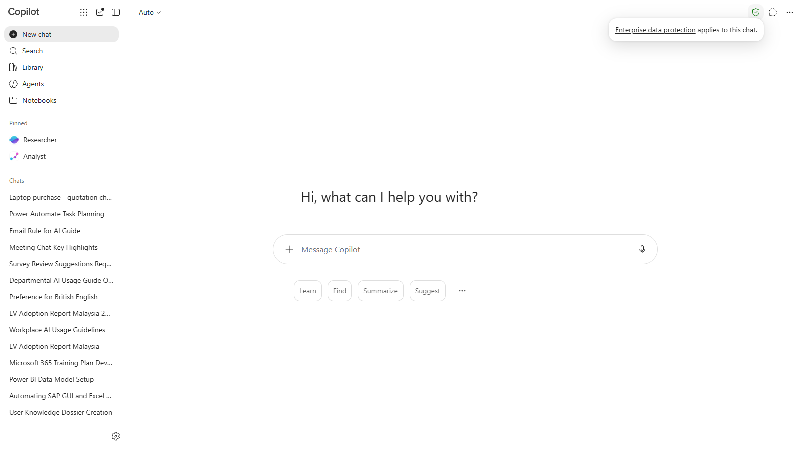
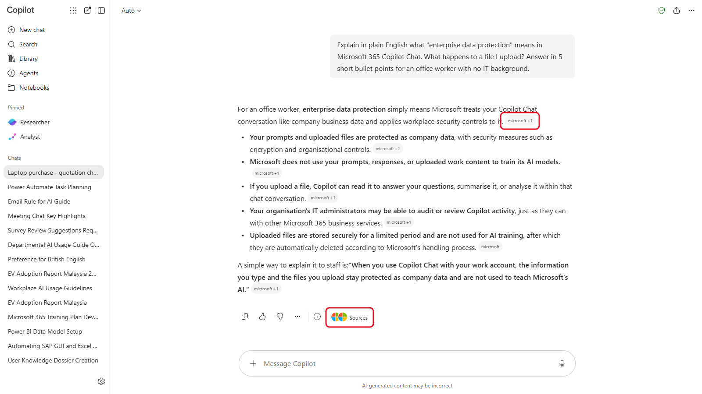

# 01 - Which Copilot Do I Have?

Before you upload a single quotation, you need to know two things: which version of Copilot your organisation has given you, and whether it's the protected work version. This chapter answers both in a few minutes, so you don't spend the rest of the day hunting for buttons you don't have.

> **Prompts:** every prompt you need is in the steps, with a Copy button. The [prompts page](./prompts.md) has them all on one page too.

**Estimated time:** 20 minutes

**Your result:** You know your Copilot label, you've seen the green shield, and you've run one safe prompt in Copilot Chat.

---

## Today's Task

Today you handle one real purchase from start to finish, using only the Copilot features that come with your license.

> **You're an executive in the Admin and Facilities department at Teratai Holdings Berhad.** The department needs 25 new laptops for next quarter's hires. Company policy says any purchase above RM20,000 needs three written quotations, a comparison, and a justification memo before the HOD signs off.

Each chapter takes the purchase one step further. In this chapter you check which Copilot you have, so it's safe to work with company documents. Then you find your way around, write the requirements for vendors, compare the quotations that come back, chase the vendors, write the memo, put everything in one place, and build an agent for next time. In the capstone, a second purchase arrives and you run it on your own. The [stage table on the home page](../#course-scenario) shows every step.

> **Note:** Teratai Holdings, the vendors and everyone in the sample files are fictional.

---

## What You Will Learn

- Find the Copilot label on your Microsoft 365 account
- Tell Copilot Chat (for work) apart from Microsoft Copilot (for personal use)
- Check for the green enterprise data protection shield before you share anything
- Know what Copilot Chat (Basic) can't do, so you stop looking for it

---

## Before You Begin

You need:

- your **work or school account** (the one you use for Outlook and Teams at work)
- a browser: Microsoft Edge or Google Chrome
- about five minutes of quiet to read the label table in 1.2

> **Note:** Use the same work account all day. If your browser is signed in to a personal Microsoft account too, open an InPrivate or Incognito window for the course so the two don't mix.

---

## 1.1 Find Your Copilot Label

Microsoft shows a short label on your account that tells you which Copilot experience you have.

1. Open the Microsoft 365 Copilot app at [m365.cloud.microsoft/chat](https://m365.cloud.microsoft/chat) and sign in with your work account.
2. Look at the bottom of the left pane. Your name is there, with a short Copilot label under it.
3. The label reads one of the three labels in the table in section 1.2.

<!-- VERIFY: confirm the exact wording of the Copilot Chat (Basic) label during the manual capture of 01-01. "M365 Copilot (Basic)" was confirmed under the name at the bottom left of the Copilot app. -->

<!-- Screenshot still to capture: 01-01-copilot-label.png. Remove this comment wrapper when the image is added.


*The label sits under your name at the bottom left. This account shows Copilot Chat (Basic).*
-->

4. Write your label down. You'll need it in Chapter 9, which is only for one of the labels.

> **If you don't see this:** Some organisations haven't received the label yet, or show it somewhere else. Ask your trainer to confirm your label. If your organisation has more than 2,000 Microsoft 365 users and you don't have a paid Copilot license, you almost certainly have **Copilot Chat (Basic)**.

---

## 1.2 Copilot Chat, Microsoft Copilot and Microsoft 365 Copilot

There are three work labels, and one consumer product with a similar name.

| Label | Who usually has it | Copilot inside Word, Excel, PowerPoint and OneNote | Copilot in Outlook | Speed at busy times |
|-------|--------------------|-----------------------------------------------------|--------------------|---------------------|
| **Copilot Chat (Basic)** | Organisations with more than 2,000 users, no paid license (since 15 April 2026) | No | Yes | Standard access, can slow down |
| **M365 Copilot (Basic)** | Smaller organisations, no paid license | Yes, standard access | Yes | Standard access, can slow down |
| **M365 Copilot (Premium)** | Anyone with the paid Microsoft 365 Copilot license | Yes, full features | Yes | Priority access |

This course is built for the two **Basic** labels. Everything on the main path works with either one. Chapter 9 is the only exception: it needs **M365 Copilot (Basic)** or Premium.

**Microsoft Copilot** (at copilot.microsoft.com, or the Copilot app that comes with Windows) is the consumer product. When you sign in with a personal Microsoft account, your chats are covered by consumer terms, and you won't see the green shield. Don't use it for company documents.

**Copilot Chat** is the work version. You reach it with your work account, and it shows the green shield you check in the next section.

<!-- Screenshot still to capture: 01-02-work-vs-personal.png. Remove this comment wrapper when the image is added.


*Same name, different products. The work version (left) is signed in with a work account and shows the shield.*
-->

> **Key point:** The account matters more than the app. The same browser can open both versions. Check which account you're signed in with before you paste or upload anything.

---

## 1.3 Check for the Green Shield

The green shield means **enterprise data protection (EDP)** applies to your chat. Your prompts and uploaded files stay inside your organisation's Microsoft 365 boundary, the same as your email and OneDrive, and they aren't used to train the AI models.

1. Open the Microsoft 365 Copilot app: go to [m365.cloud.microsoft/chat](https://m365.cloud.microsoft/chat). You can also select **Copilot** from the left side of the Microsoft 365 home page.
2. Look at the top-right corner of the page for a small green shield.
3. Point at the shield with your mouse (don't click). A tooltip appears: **Enterprise data protection applies to this chat.**



*Point at the shield to see the tooltip. No shield means no enterprise data protection.*

> **Warning:** No shield, no upload. If you can't see the green shield, you're probably signed in with a personal account. Stop, sign out, and sign back in with your work account before you continue.

**Checkpoint:** You can see the green shield and its tooltip.

---

## 1.4 What Basic Can't Do

These features exist, and you'll see them in Microsoft videos and articles. They need the paid license (or a preview your organisation has signed up for), so they aren't in this course:

- **Researcher** and **Analyst**, the deep research and data analysis agents
- **Cowork**
- searching your work files, Teams chats, meetings and SharePoint from Copilot Chat. With Basic, Copilot works with the web and the files you upload, plus your mailbox and calendar inside Outlook (Chapter 5)
- agents that use SharePoint sites or files as knowledge
- custom skills in Agent Builder
- voice conversations with Copilot
- priority access at busy times

You may still see **Researcher** and **Analyst** listed under **Pinned** in the left pane. They belong to the paid license and aren't part of this course, so leave them alone.

If a colleague shows you one of these, you're not missing a setting. Your license doesn't include it.

> **If you don't see this:** Your organisation's admin can turn off parts of Copilot Chat, such as file upload, image generation or agents. If a button from this course is missing for you but not for the person next to you, tell your trainer. Standard access can also be slow or temporarily limited at peak times: if a response stalls, wait a minute and send the prompt again.

---

## 1.5 Run Your First Safe Prompt

Time to use it. This prompt asks Copilot about its own protections, using the web.

1. In the Copilot app, select **New chat** at the top left.
2. Click in the message box at the bottom, paste the prompt below, and press Enter.

   ```
   Explain in plain English what "enterprise data protection" means in Microsoft 365 Copilot Chat. What happens to a file I upload? Answer in 5 short bullet points for an office worker with no IT background.
   ```

3. Read the answer. Look for the small grey labels at the end of sentences, such as **microsoft +1**. They name the websites Copilot used. **Sources** under the answer lists them all.



*Each small label shows where a fact came from. You check these properly in Chapter 3.*

---

## Independent Practice

Ask Copilot what Copilot Chat (Basic) can't do, using the second prompt on the [prompts page](./prompts.md). Compare its answer with the list in 1.4. Did it get anything wrong or out of date? Copilot's knowledge of its own features isn't always current, which is a useful thing to learn on day one.

---

## Troubleshooting

| Symptom | What to check |
|---------|---------------|
| No green shield | You're signed in with a personal account. Sign out and sign in with your work account |
| The page asks you to sign in again and again | Clear the browser's cookies for microsoft.com, or use an InPrivate window |
| You see Word, Excel and PowerPoint buttons in Copilot but no Copilot inside the apps | That's normal for **Copilot Chat (Basic)**. The apps open, but without Copilot inside them |
| The answer is slow or stops halfway | Standard access is busy. Wait a minute and try again |
| Your label isn't shown anywhere | Ask your trainer. Your organisation may not have the label yet |

---

## Lesson Summary

You found your label, learned that the work account and the green shield are what make Copilot safe for company documents, and saw the short list of things Basic doesn't include. Next, you find all the ways into Copilot Chat and learn the controls around the message box.

**Check yourself:** Can you name your label, point to the shield, and name two features Basic doesn't include?

For reference, see Microsoft's [Copilot Chat privacy and protections](https://learn.microsoft.com/en-us/copilot/privacy-and-protections) page.
