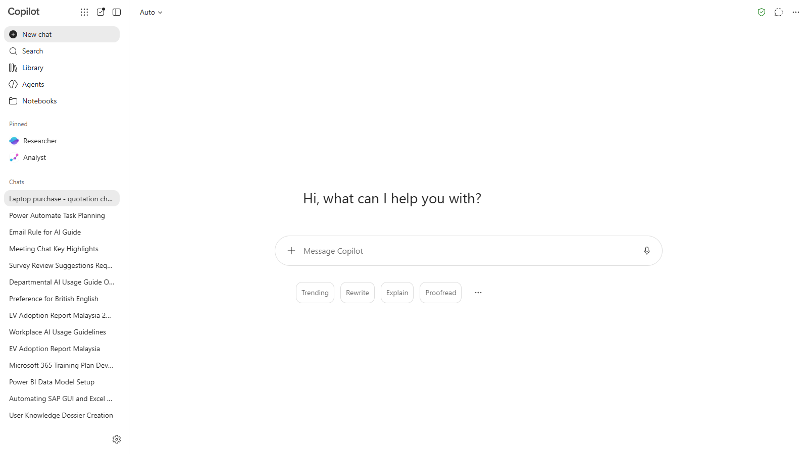
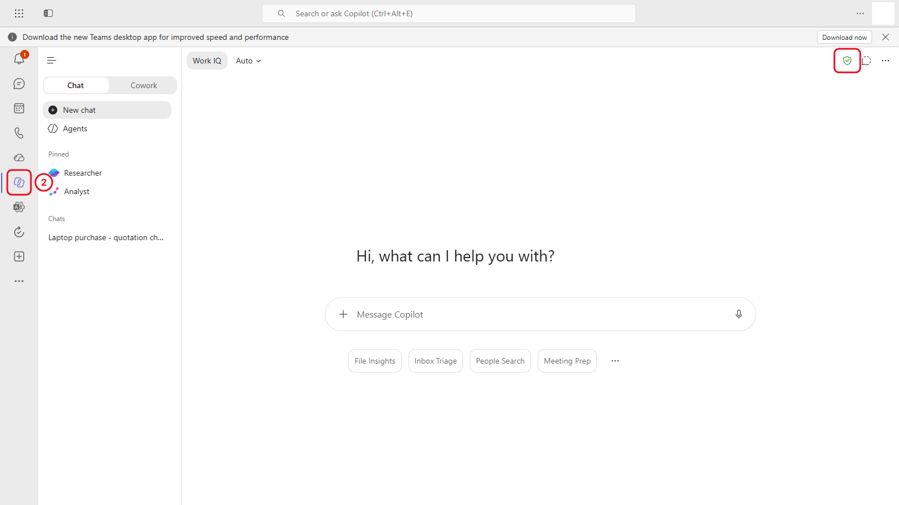
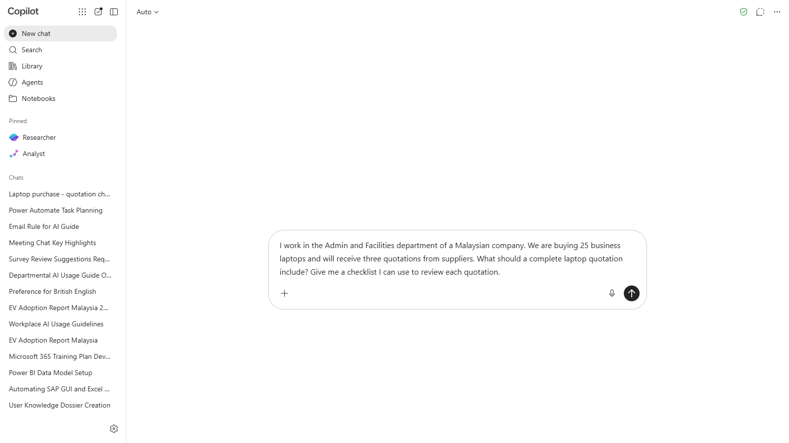
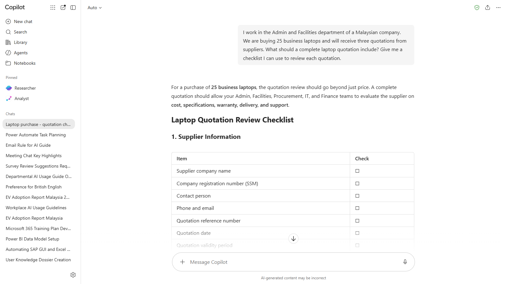
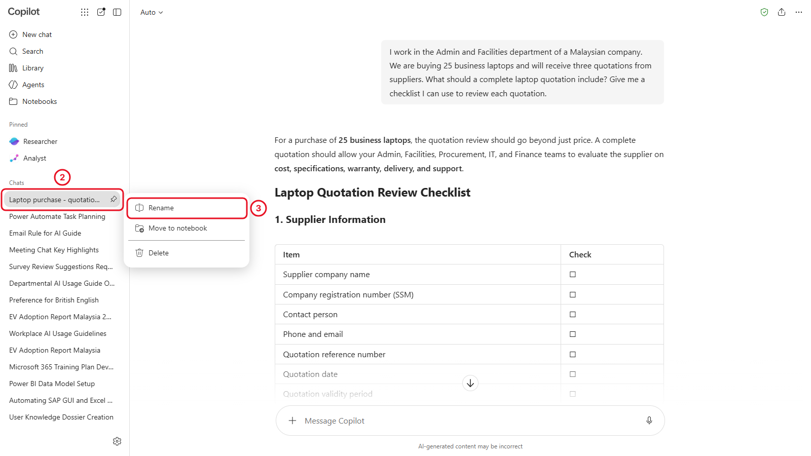
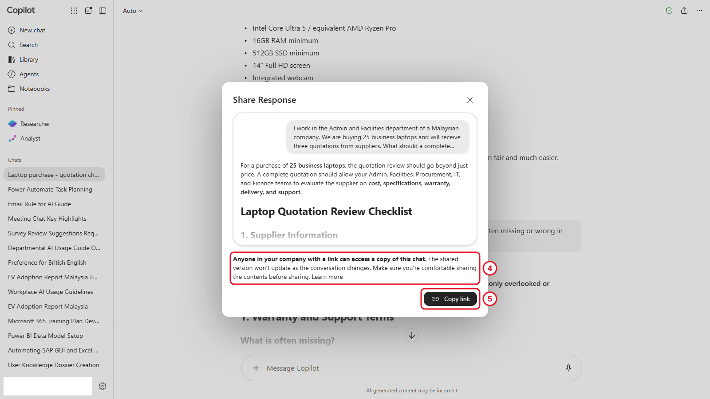

# 02 - Find Your Way Around

You'll spend most of today in the Microsoft 365 Copilot app, so it pays to know where things are. This chapter tours the app, shows the other places you can open Copilot Chat, and gets you asking your first purchase question: what should a good laptop quotation include?

> **Prompts:** every prompt you need is in the steps, with a Copy button. The [prompts page](./prompts.md) has them all on one page too.

**Estimated time:** 30 minutes

**Your result:** A named chat about laptop quotations that you can find again, and a shared link to one of Copilot's answers.

---

## What You Will Learn

- Open Copilot Chat from the Copilot app, Edge, Teams and Outlook
- Use the controls around the message box
- Start, rename, find and delete chats
- Share a response with a colleague
- Add a screenshot to a prompt (Windows)

---

## Before You Begin

You need the green shield from section 1.3. If you can't see it, go back to Chapter 1 before you continue.

---

## Apps You'll Use

Everything in this course runs in the browser, apart from the screenshot tool in 2.7. Start from the Microsoft 365 home page and you can reach every app from it.

| App | Web address | What you use it for |
|-----|-------------|---------------------|
| Microsoft 365 Copilot app | [m365.cloud.microsoft/chat](https://m365.cloud.microsoft/chat) | Copilot Chat, Pages, Notebooks and agents. Your main workspace today |
| Outlook | [outlook.office.com](https://outlook.office.com) | Copilot in Outlook (Chapter 5) |
| Teams | [teams.microsoft.com](https://teams.microsoft.com) | Another way into Copilot Chat |
| Microsoft Edge | Installed on your computer | Copilot in the sidebar |

---

## 2.1 Open the Microsoft 365 Copilot App

1. Go to [m365.cloud.microsoft/chat](https://m365.cloud.microsoft/chat). Sign in with your work account if asked.
2. Find the parts of the screen, using the picture below:
   - the **left pane**: **New chat**, **Search**, **Library**, **Agents** and **Notebooks** at the top, then **Pinned** items, then your recent **Chats**
   - the **message box** in the middle of the page, where you type
   - the **green shield** at the top right



*The three areas you use all day: the left pane, the message box and the shield. Your list of chats will be shorter, or empty, on your first day.*

> **Note:** You may see **Researcher** and **Analyst** under **Pinned**. They belong to the paid license and aren't used in this course, so leave them alone.

> **Tip:** Your Copilot Pages are kept under **Library**. You'll use them in Chapter 6.

> **Tip:** Pin the tab (right-click the browser tab, then **Pin**) so Copilot is always one click away during the course.

---

## 2.2 Other Ways In: Edge, Teams and Outlook

The same Copilot Chat, with the same green shield, is available in other places. Your chats in the Copilot app also show up in Teams. A chat you have in Edge or Outlook may only stay there, depending on how your organisation set things up.

<!-- VERIFY: whether chats started in Edge and Outlook appear in the Copilot app history for Basic users. -->

**Microsoft Edge**

1. Open Microsoft Edge and sign in to Edge with your work account (select the profile picture at the top left of Edge).
2. Select the **Copilot** icon at the top right of the Edge window. A sidebar opens.
3. Check the sidebar shows the green shield. If it shows your personal account, switch Edge profiles first.

<!-- Screenshot still to capture: 02-02-edge-sidebar.png. Remove this comment wrapper when the image is added.


*The Edge sidebar can read the web page you have open. That's useful for summarising a supplier's website.*
-->

**Teams**

1. Open Teams.
2. Select **Copilot** in the bar of apps on the far left. Copilot opens inside Teams, with the green shield at the top right.

<!-- VERIFY: retake 02-03 with a clean Basic account. This capture shows a Work IQ toggle, a Cowork tab and Inbox Triage / People Search suggestions, which belong to the paid license. -->



*Copilot in Teams is the same Copilot Chat, and your chats from the Copilot app show up here too. If you see a **Work IQ** button or a **Cowork** tab, as in this picture, they belong to the paid license and aren't part of this course.*

**Outlook**

Copilot in Outlook has its own buttons for summarising and drafting email. You use it in Chapter 5, so there's nothing to do here yet.

> **If you don't see this:** Your organisation may have hidden Copilot in Teams or Edge, or the Copilot icon in Edge may have moved to a different spot after an update. The Copilot app at m365.cloud.microsoft/chat always works if Copilot Chat is turned on for you.

---

## 2.3 The Message Box

Everything you ask goes through the message box. Point at each control to see its name.

1. Select **New chat**.
2. Point at each control to see its name:
   - **+** (**Add and manage sources**) on the left of the box, to add files and images. You use it in Chapter 4
   - the **Send** arrow on the right, which appears once you start typing
   - **Open prompt gallery**, with ready-made prompts (Chapter 3). It sits next to the suggestion buttons under the empty box, and disappears while you type
   - **Auto**, at the top left of the page, which chooses how Copilot answers. Leave it on **Auto** for this course

<!-- VERIFY: retake 02-04 with an empty message box so the prompt gallery control shows. -->



*Type in the box and the Send arrow appears. The Auto setting is at the top left of the page.*

> **Note:** You'll see a microphone (**Start dictation**) in the message box. Dictation types what you say into the box. Voice conversations with Copilot need priority access, so they aren't part of this course.

---

## 2.4 Run Your First Prompt

The department needs 25 laptops, and three vendors will send quotations. Before they arrive, find out what a good quotation should include.

1. In the message box, paste the prompt below and press Enter.

   ```
   I work in the Admin and Facilities department of a Malaysian company. We are buying 25 business laptops and will receive three quotations from suppliers. What should a complete laptop quotation include? Give me a checklist I can use to review each quotation.
   ```

2. Read the answer. Copilot uses the web to answer, so it may show sources.
3. Ask a follow-up in the same chat. Copilot remembers what you've already discussed in this chat:

   ```
   Which three items on that checklist are most often missing or wrong in real quotations? Explain why each one matters.
   ```



*A first checklist. In Chapter 4 you compare the real quotations with your company's own policy, which matters more than any general checklist.*

**Checkpoint:** You have one chat with two answers in it.

---

## 2.5 Find and Manage Your Chats

Copilot names each chat for you, usually from your first prompt. A clear name makes it easy to find later.

1. In the left pane, find your chat under your recent chats.
2. Point at it and select the **...** (More options) that appears.
3. Select **Rename** (the menu also has **Move to notebook** and **Delete**), type the name below, and press Enter.

   ```text
   Laptop purchase - quotation checklist
   ```

4. Select **New chat**, then select your renamed chat again. Your conversation is still there.
5. To delete a chat you don't need, use the same **...** menu and select **Delete**. Don't delete this one.
6. To find an older chat, select **Search** at the top of the left pane and type a word from its name.



*Rename, Move to notebook and Delete are in the More options menu beside each chat.*

> **Tip:** Start a new chat for each new task. Mixing two jobs in one chat confuses Copilot, because it tries to use everything earlier in the chat as context.

---

## 2.6 Share a Response

The quickest way to pass an answer on is to copy it.

1. Under the checklist answer, point at the response to show its buttons.
2. Select **Copy** (the two-squares icon). The text is copied with its formatting, ready to paste into an email, a Teams chat or a document.

Some organisations can also share a link to a response.

3. Select **More options** (**...**) under the response. If you see **Share response**, select it.
4. Read the notice. Anyone in your company with the link can open a copy of the chat, and the copy doesn't change if you carry on chatting.
5. Select **Copy link** only if you want to share it. For this exercise, select the **X** to close the box instead.



*Anyone in your company with the link can read a copy of this chat. Check what's in it before you share.*

> **If you don't see this:** **Share response** is an early-access (Frontier) feature, so many organisations don't have it yet. Use **Copy** instead.

> **Important:** Only share responses that contain information your colleague is allowed to see. Once a chat includes details from an uploaded quotation, treat a shared link like the quotation itself.

---

## 2.7 Use the Screenshot Tool (Windows)

On Windows, you can capture part of your screen and add it to a prompt without saving a file first. This is handy when you want Copilot to explain an error message or read a table on a supplier's website.

1. Open the **Microsoft 365 Copilot app on Windows** (installed on your computer, not the browser).
2. In the message box, select **+** and then the screenshot option.
3. Drag a box around part of your screen. The picture appears in the message box.
4. Type a question about it, for example: `What does this message mean, and what should I do next?`

<!-- VERIFY: capture 02-08 by hand in the Windows desktop app; confirm the option's name and position. In the browser, the + menu has Upload images and files, Attach cloud files and Designer, and no screenshot option. -->

<!-- Screenshot still to capture: 02-08-screenshot-tool.png. Remove this comment wrapper when the image is added.


*Capture, then ask. The screenshot is treated like any other uploaded image.*
-->

> **If you don't see this:** The browser version of Copilot doesn't have the screenshot tool, and it's still reaching some Windows computers. Use the Windows Snipping Tool instead (Windows key + Shift + S), save the picture, and add it with **+** like any other file.

---

## Independent Practice

Start a new chat and ask Copilot how to tell whether a laptop warranty is "onsite" or "carry-in", and why the difference matters to a company with 25 users. Rename the chat so you can find it later.

---

## Troubleshooting

| Symptom | What to check |
|---------|---------------|
| Your old chats are missing | Check you're signed in with the same work account. Chats from another account don't appear |
| The Copilot icon in Edge opens a personal Copilot | Switch the Edge profile to your work account |
| Rename isn't in the menu | Open the chat first, then point at its name in the left pane |
| **Share response** isn't in the menu | It's an early-access feature your organisation may not have. Use **Copy** instead |
| A prompt stops halfway | Standard access is busy. Wait a moment and send it again |

---

## Lesson Summary

You can now open Copilot Chat from four places, find your way around the message box, and keep your chats tidy. You also have a first checklist for reviewing quotations. Next, you learn a simple framework that makes every prompt you write more useful.

**Check yourself:** Can you rename a chat, find it again, and share one response?
