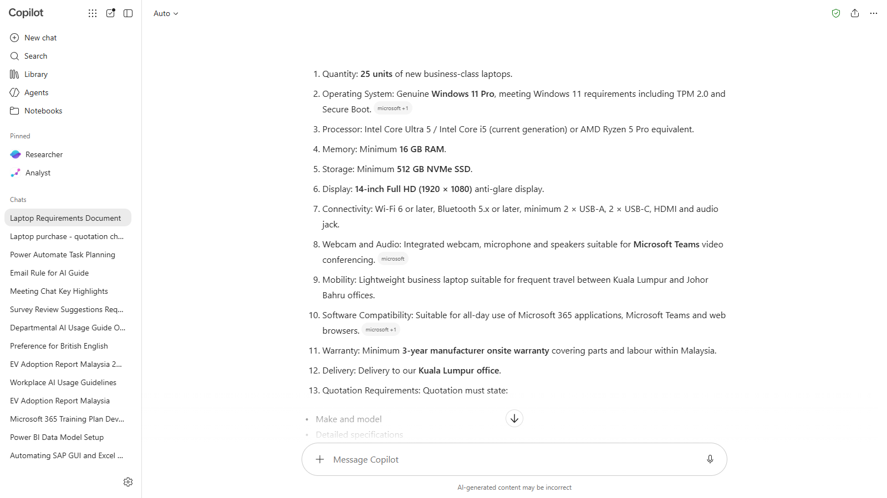
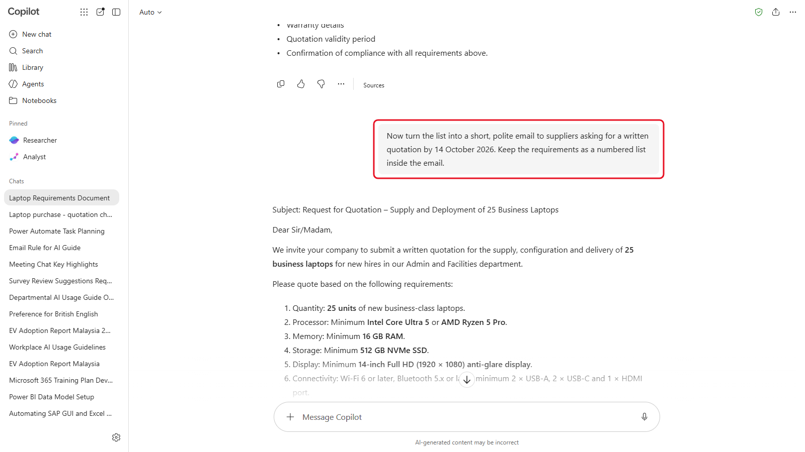
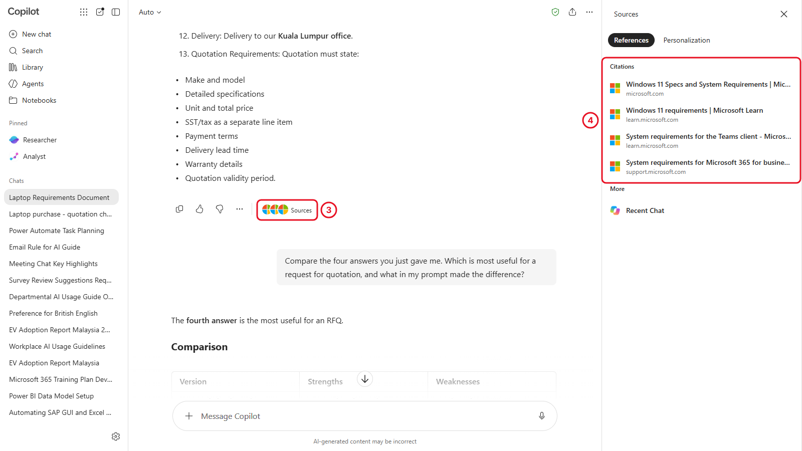
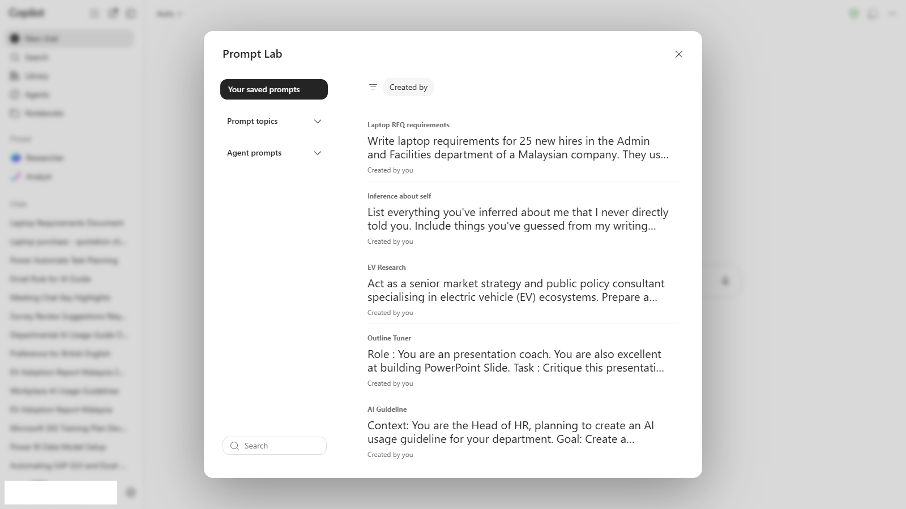
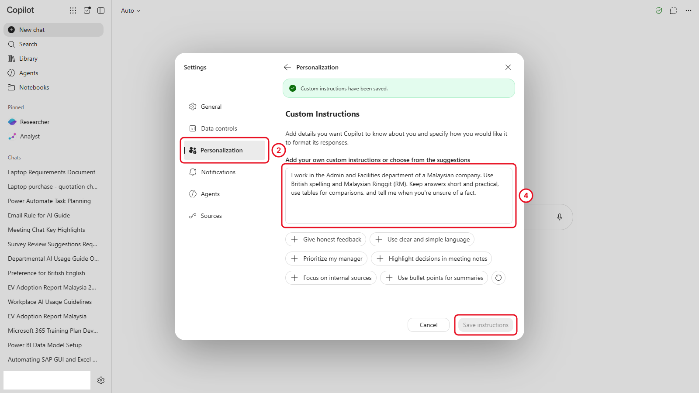
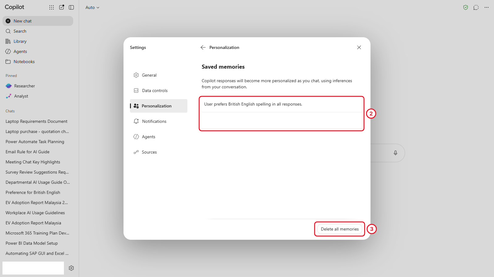

# 03 - Write Better Prompts

> **The purchase so far:** You know what a complete laptop quotation should include (Chapter 2). Now you write the requirements you'll send to three vendors.

What Copilot gives you depends on what you give it. In this chapter you use a four-part framework, GCSE, to write the requirements you'll send to the three laptop vendors. Then you improve the answer, check where it came from, and save your best prompt so you can reuse it.

> **Prompts:** every prompt you need is in the steps, with a Copy button. The [prompts page](./prompts.md) has them all on one page too.

**Estimated time:** 45 minutes

**Your result:** A short set of laptop requirements, ready to send to vendors, plus a saved prompt and your own custom instructions.

---

## What You Will Learn

- Write a prompt with the four GCSE parts: Goal, Context, Source and Expectations
- Improve a response with follow-up prompts instead of starting again
- Check Copilot's sources before you trust a fact
- Save a prompt in Prompt Gallery
- Set custom instructions and manage what Copilot remembers about you

---

## Before You Begin

You need the Copilot app open with the green shield showing. Start each part in a **new chat** unless the step says otherwise.

---

## 3.1 The GCSE Framework

A good prompt usually has four parts. You don't need all four every time, but the more of them you include, the less Copilot has to guess.

| Part | The question it answers | Example from today |
|------|------------------------|--------------------|
| **G: Goal** | What do you want Copilot to do? | "Draft the requirements for a laptop quotation request..." |
| **C: Context** | Who are you, and what's the situation? | "...for 25 new hires in the Admin and Facilities department of a Malaysian company..." |
| **S: Source** | What should Copilot use? | "...based on current business laptop guidance from reputable sources..." |
| **E: Expectations** | What should the result look like? | "...as a numbered list under 200 words, in plain English." |

With Copilot Chat (Basic), your sources are the public web, the files you upload, and anything you paste into the prompt. Naming the source tells Copilot which to rely on.

---

## 3.2 Build the Laptop Requirements Step by Step

You'll send the same request four times, adding one GCSE part each time, and watch the answer change. Use the **same chat** for all four steps.

1. Select **New chat**. Send the Goal only:

   ```
   Write laptop requirements.
   ```

2. Read the answer, then add Context. Send:

   ```
   Write laptop requirements for 25 new hires in the Admin and Facilities department of a Malaysian company. They use Microsoft 365, Teams video calls and a browser all day, and travel between our Kuala Lumpur and Johor Bahru offices.
   ```

3. Add a Source. Send:

   ```
   Write laptop requirements for 25 new hires in the Admin and Facilities department of a Malaysian company. They use Microsoft 365, Teams video calls and a browser all day, and travel between our Kuala Lumpur and Johor Bahru offices. Base the specifications on current guidance from reputable sources for business laptops running Windows 11, and show your sources.
   ```

4. Add Expectations. Send:

   ```
   Write laptop requirements for 25 new hires in the Admin and Facilities department of a Malaysian company. They use Microsoft 365, Teams video calls and a browser all day, and travel between our Kuala Lumpur and Johor Bahru offices. Base the specifications on current guidance from reputable sources for business laptops running Windows 11, and show your sources.

   Format it as a numbered list I can paste into a request for quotation, under 200 words. Include minimum specifications, a 3-year onsite warranty, delivery to our Kuala Lumpur office, and a reminder that the quotation must show its validity period, tax as a separate line, payment terms and delivery lead time.
   ```



*The full GCSE prompt gives a list you could almost send as it is.*

5. Scroll up and compare the four answers. Then ask Copilot to compare them for you:

   ```
   Compare the four answers you just gave me. Which is most useful for a request for quotation, and what in my prompt made the difference?
   ```

> **Key point:** The fourth prompt is long, and that's fine. A long, clear prompt gets you a usable answer the first time. A short prompt gets you a general answer and several rounds of follow-up.

---

## 3.3 Improve the Answer

You don't need to start again when an answer is nearly right. Tell Copilot what to change, in the same chat.

1. Send each of these, one at a time, and watch the list change:

   ```
   Make the minimum specifications more specific: name the minimum processor class, memory, storage and screen size.
   ```

   ```
   Add a requirement that every laptop comes with a bag, and that the supplier images the laptops with our standard Windows 11 setup before delivery.
   ```

   ```
   Now turn the list into a short, polite email to suppliers asking for a written quotation by [date]. Keep the requirements as a numbered list inside the email.
   ```

2. Replace `[date]` in the last prompt with a real date before you send it, or ask Copilot to leave it as a placeholder.



*Three follow-ups turned a list into an email you can send. You didn't retype the requirements once.*

> **Tip:** Say exactly what to change and what to keep. "Make it better" gives Copilot nothing to work with. "Keep the list, shorten the introduction to one sentence" does.

---

## 3.4 Check the Sources

Copilot uses the web to answer, and it shows where its facts came from. A source can be out of date, from a seller, or about another country. Checking takes a minute.

1. Go back to the answer from step 4 in section 3.2.
2. Find the small grey labels at the end of sentences, such as **microsoft +1**. They show which website each fact came from.
3. Select **Sources** under the answer. A **Sources** pane opens on the right, with the pages Copilot used listed under **References**.
4. Select a source to open it in a new tab. Check:
   - **Who wrote it?** A manufacturer selling laptops has a reason to recommend more expensive models.
   - **When?** Laptop advice from three years ago is already out of date.
   - **Does it say what Copilot said?** Find the sentence on the page that supports Copilot's claim.



*Sources lists every page behind the answer, with the website under each title.*

5. If you find a claim with no source, or a source that doesn't support it, ask:

   ```
   Which of the requirements in your list are not supported by one of your sources? Mark them clearly.
   ```

> **Key point:** A source makes an answer easier to check. It doesn't make the answer correct. You're responsible for anything you send to a supplier or your HOD.

---

## 3.5 Save a Prompt in Prompt Gallery

Prompt Gallery holds ready-made prompts from Microsoft and prompts you save yourself. Save the full GCSE prompt so you can reuse it for the next purchase.

1. In your chat, point at your full GCSE prompt from step 4 in 3.2. Buttons appear beside it.
2. Select **Save prompt**, give it a title such as `Laptop RFQ requirements`, and save it.
3. Select **New chat**, then **Open prompt gallery** (beside the suggestion buttons under the empty message box). The gallery opens as **Prompt Lab**.
4. Select **Your saved prompts**. Your prompt is listed there.
5. Open **Prompt topics** to browse Microsoft's ready-made prompts. Select one to see how it's written.



*Your saved prompts are listed first. Microsoft's examples are under Prompt topics.*

> **If you don't see this:** If there's no save option beside your prompt, copy the prompt into a note instead (OneNote or a Word document). Prompt Gallery may look different in your organisation, or saving may still be rolling out.

---

## 3.6 Custom Instructions and Memory

You've typed "I work in Admin and Facilities at a Malaysian company" several times now. Custom instructions tell Copilot that once, and it applies them to every new chat.

**Set custom instructions**

1. At the bottom of the left pane, select **Settings and more** (the gear), then **Settings**.
2. Select **Personalization**.
3. Under custom instructions, select **Edit instructions**.
4. Paste the text below into the box, change it to fit you, and select **Save instructions**.

   ```
   I work in the Admin and Facilities department of a Malaysian company. Use British spelling and Malaysian Ringgit (RM). Keep answers short and practical, use tables for comparisons, and tell me when you're unsure of a fact.
   ```



*The green message confirms they're saved. Custom instructions apply to new chats, not to chats you've already started.*

5. Select **New chat** and send `What spelling and currency will you use when you answer me?` to test it.

**Memory**

Copilot can also remember facts from your chats, such as your role or preferences, and use them later. It usually asks before it saves a memory.

1. Go back to **Settings** > **Personalization**. The **Saved memories** switch turns memory on or off. Leave it as your trainer asks.
2. Open **Saved memories** to see what Copilot has remembered, if anything.
3. Point at a memory to delete just that one, or select **Delete all memories** at the bottom.



*You can see and delete everything Copilot has remembered about you.*

> **Important:** Don't ask Copilot to remember anything confidential, such as budget figures, staff names or passwords. Memory is for preferences and your role, not for data.

> **If you don't see this:** Your admin may have turned memory or custom instructions off. If **Personalization** isn't in Settings, carry on: you can put the same text at the start of a prompt instead.

---

## Independent Practice

Write a GCSE prompt of your own for the next small purchase your department makes, such as office chairs or a projector. Label each part (G, C, S, E) in your head as you write it. Ask the person next to you to spot which part is missing.

---

## Troubleshooting

| Symptom | What to check |
|---------|---------------|
| The answer ignores part of a long prompt | Put each requirement on its own line, or ask "Did you include all the requirements I listed?" |
| No sources are shown | Ask "Show your sources." Some answers come from Copilot's general knowledge and have none |
| A source link opens an unrelated page | The source may have changed. Treat that fact as unchecked |
| Custom instructions aren't applied | They only affect new chats. Select **New chat** |
| The response stops halfway | Standard access is busy. Wait a minute and send it again |

---

## Lesson Summary

GCSE gave you a way to write a prompt that works the first time. You improved the answer with specific follow-ups, checked its sources, and saved your prompt and your preferences so you don't repeat yourself. Next, the quotations arrive, and you use Copilot to compare them against your company's policy.

**Check yourself:** Can you name the four GCSE parts, and explain why a source doesn't make an answer correct?
