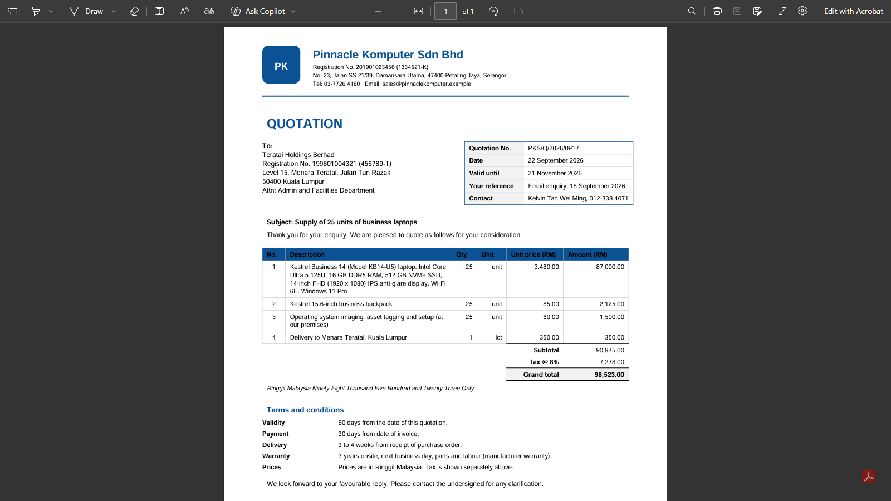
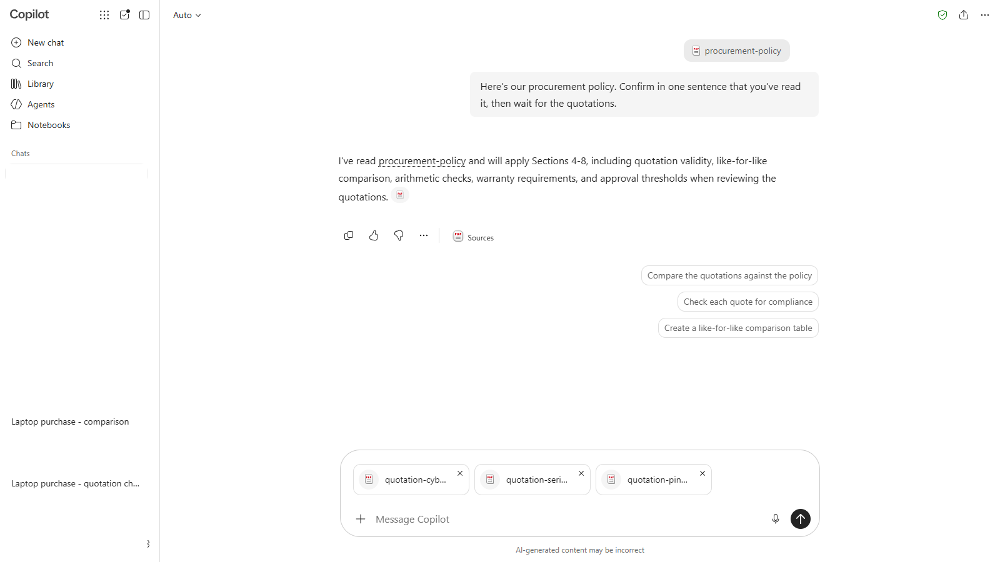
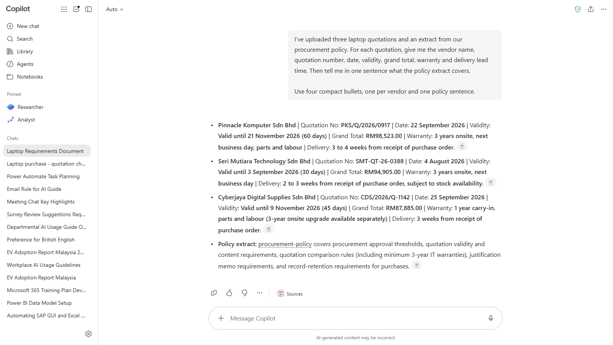
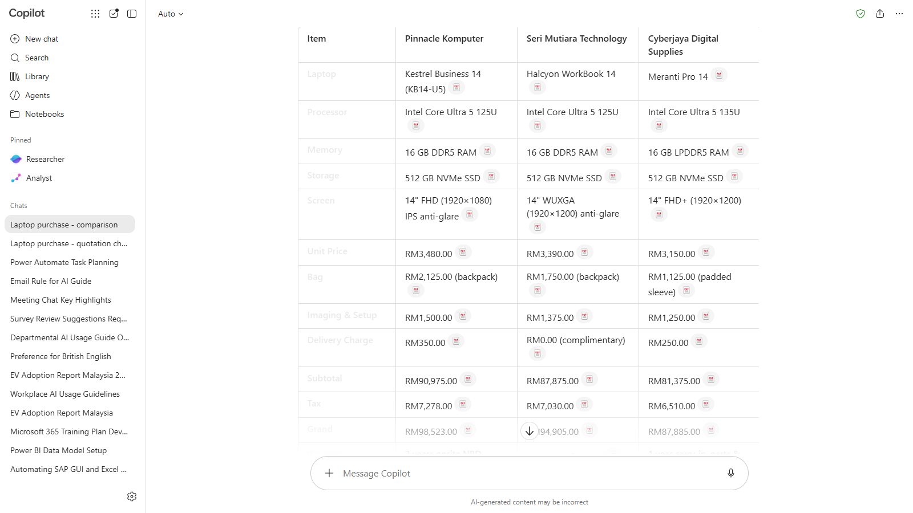
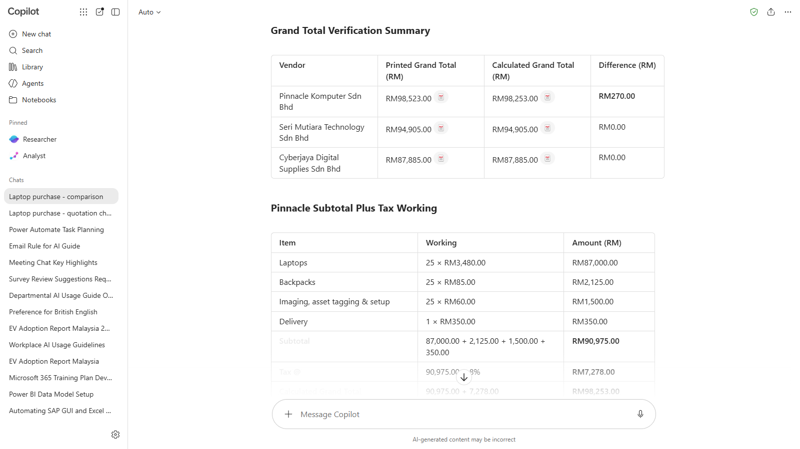
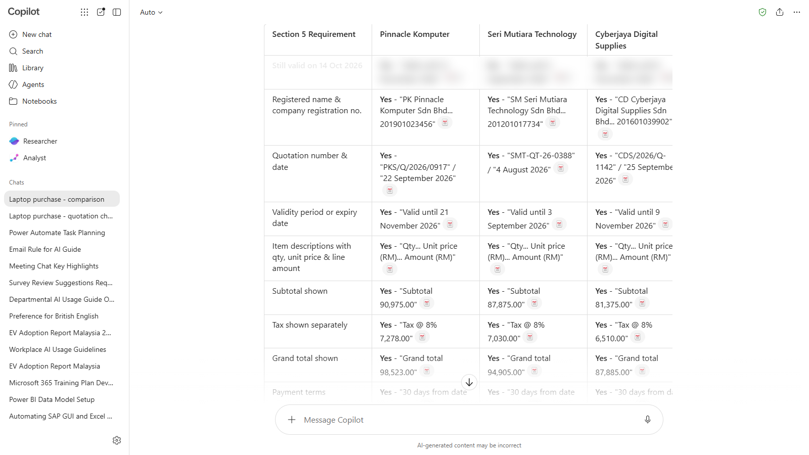
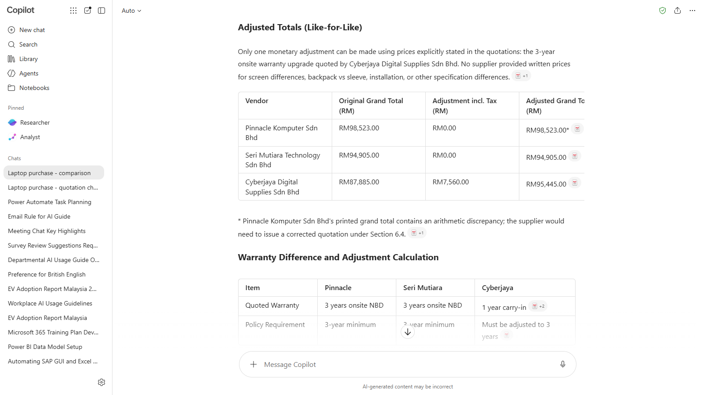
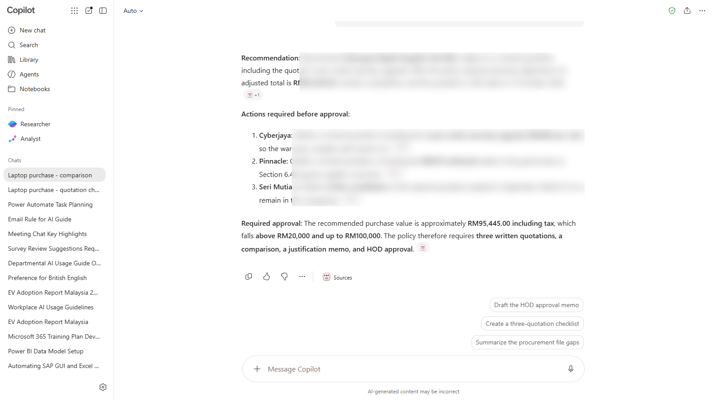

# 04 - Compare the Quotations

> **The purchase so far:** Your requirements went out to three vendors (Chapter 3), and their quotations are back.

Before the HOD can sign off, policy says you need a written comparison and a justification memo. In this chapter you upload the quotations and the procurement policy, ask Copilot to build the comparison, and then do the part that matters most: check its work. Each quotation has a problem. Your job is to find all three.

> **Prompts:** every prompt you need is in the steps, with a Copy button. The [prompts page](./prompts.md) has them all on one page too.

**Estimated time:** 60 minutes

**Your result:** A checked comparison table of the three quotations, a list of problems to chase, and a recommendation you can defend.

---

## What You Will Learn

- Upload several files to one chat and ask questions across them
- Turn three quotations into one comparison table
- Check Copilot's arithmetic instead of trusting it
- Check documents against a policy, including dates
- Spot when a comparison isn't like-for-like, and adjust it
- Ask for a recommendation with reasons

---

## Before You Begin

You need:

- the green shield showing in the Copilot app (section 1.3)
- the four sample files, which you download in 4.1
- a calculator (the one on your computer or phone is fine)

| File | What it is |
|------|------------|
| `quotation-pinnacle-komputer.pdf` | Vendor A, Pinnacle Komputer Sdn Bhd, Petaling Jaya |
| `quotation-seri-mutiara.pdf` | Vendor B, Seri Mutiara Technology Sdn Bhd, Shah Alam |
| `quotation-cyberjaya-digital.pdf` | Vendor C, Cyberjaya Digital Supplies Sdn Bhd, Cyberjaya |
| `procurement-policy.pdf` | A two-page extract from Teratai Holdings' procurement policy |

> **Note:** Some screenshots in this chapter are blurred where they would give away the answers. Each step has a **What should you see?** box with the expected result. Try the step first, then open the box to check. Finding the problems yourself is the point of the lab.

> **Note:** Every company, person and number in these files is fictional. The tax rate is for training only. Never practise with real supplier quotations: they can contain prices and terms your company has agreed to keep confidential.

---

## 4.1 Download the Sample Files

1. Download **[sample-files.zip](./sample-files.zip)** (one click, all four files).
2. Open your Downloads folder, right-click the ZIP and choose **Extract All**, then **Extract**.
3. Open one quotation and have a quick look. You'll find a letterhead, a quotation number, a date, a validity period, line items, a tax line, a grand total and the terms. That's what Copilot is about to read.



*A typical quotation. Copilot reads the text in the PDF, including the small print in the terms.*

---

## 4.2 Start a New Chat and Upload the Files

1. In the Copilot app, select **New chat**. Check the green shield.
Copilot takes at most three files in one message, so the policy goes first, on its own.

2. In the message box, select **+**, then **Upload images and files**. Go to the extracted folder, select `procurement-policy.pdf` and select **Open**.
3. Wait for the upload to finish, then send this message with it:

   ```
   Here's our procurement policy. Confirm in one sentence that you've read it, then wait for the quotations.
   ```

4. Select **+** > **Upload images and files** again. Select the three quotations at once: click the first, then hold **Ctrl** and click the other two. Select **Open**.
5. Wait until each file shows in the message box without a progress circle. Don't send anything yet: the prompt for these files is in 4.3.



*Three quotations attached, ready for the prompt in 4.3. The policy is already in the chat from your first message.*

> **Note:** You may see a notice that uploading from your device saves a copy to your OneDrive. That's normal: the files stay in your organisation's storage.

> **Important:** Upload all four files in the **same chat**. Copilot can only compare files that are in the conversation it's working in. A quotation you uploaded in a different chat is invisible to this one.

> **If you don't see this:** If Copilot refuses a file, check you've attached no more than three to one message. If upload is greyed out or missing, your admin may have turned it off, or standard access may be limiting uploads at a busy time. Wait a few minutes and try again, or tell your trainer.

---

## 4.3 Summarise Each Quotation

Start with a summary of each file. It shows you whether Copilot read every file before you ask it to compare them.

1. With the four files attached, paste the prompt below and send it.

   ```
   I've uploaded three laptop quotations and an extract from our procurement policy. For each quotation, give me the vendor name, quotation number, date, validity, grand total, warranty and delivery lead time. Then tell me in one sentence what the policy extract covers. Use four short bullets: one per vendor and one for the policy.
   ```

2. Check that all three vendors and the policy appear in the answer. If one is missing, say so: `You missed the Seri Mutiara quotation. Please include it.`



*If a file is missing from the summary, Copilot didn't read it. Fix that before you go on.*

<details markdown="1">
<summary>What should you see?</summary>

Four bullets: one per vendor and one for the policy. The figures are as printed in each quotation.

| Vendor | Quotation No. | Date | Validity | Grand total | Warranty | Lead time |
|--------|---------------|------|----------|-------------|----------|-----------|
| Pinnacle Komputer | PKS/Q/2026/0917 | 22 September 2026 | Until 21 November 2026 | RM98,523.00 | 3 years onsite, next business day | 3 to 4 weeks |
| Seri Mutiara Technology | SMT-QT-26-0388 | 4 August 2026 | 30 days (to 3 September 2026) | RM94,905.00 | 3 years onsite, next business day | 2 to 3 weeks, subject to stock |
| Cyberjaya Digital Supplies | CDS/2026/Q-1142 | 25 September 2026 | Until 9 November 2026 | RM87,885.00 | 1 year carry-in | 3 weeks |

The policy bullet should say the extract covers approval thresholds (Section 4), what a valid quotation must show (Section 5), comparing quotations (Section 6) and the justification memo (Section 7).

Don't expect Copilot to point out problems yet. A summary reports what's printed. The checks come in 4.5 to 4.7.

</details>

---

## 4.4 Build the Comparison Table

1. In the same chat, send:

   ```
   Build a side-by-side comparison table of the three quotations. Use one column per vendor and these rows: laptop model, processor, memory, storage, screen, unit price, bag, imaging and setup, delivery charge, subtotal, tax, grand total, warranty, delivery lead time, payment terms, validity. Use RM and show the figures exactly as printed in each quotation.
   ```

2. Read the table, row by row.



*A clean table. It looks finished, which is exactly why you check it next.*

> **Key point:** "Exactly as printed" matters. You want the table to show what each vendor wrote, mistakes included, so you can check it. If Copilot quietly fixes a figure, you lose the evidence.

<details markdown="1">
<summary>What should you see?</summary>

| | Pinnacle Komputer | Seri Mutiara Technology | Cyberjaya Digital Supplies |
|---|---|---|---|
| Laptop model | Kestrel KB14-U5 | Halcyon WorkBook 14 | Meranti Pro 14 |
| Processor | Core Ultra 5 125U | Core Ultra 5 125U | Core Ultra 5 135U |
| Memory | 16 GB | 16 GB | 16 GB LPDDR5 |
| Storage | 512 GB | 512 GB | 512 GB |
| Screen | 14" FHD 1920x1080 | 14" WUXGA 1920x1200 | 14" FHD+ 1920x1200 |
| Unit price | RM3,480.00 | RM3,390.00 | RM3,150.00 |
| Bag | Backpack, RM85.00 | Backpack, RM70.00 | Sleeve, RM45.00 |
| Imaging and setup | RM60.00 per unit | RM55.00 per unit, with asset tagging | RM50.00 per unit |
| Delivery charge | RM350.00 | Complimentary | RM250.00 |
| Subtotal | RM90,975.00 | RM87,875.00 | RM81,375.00 |
| Tax (8%) | RM7,278.00 | RM7,030.00 | RM6,510.00 |
| Grand total | RM98,523.00 | RM94,905.00 | RM87,885.00 |
| Warranty | 3 years onsite, next business day | 3 years onsite, next business day | 1 year carry-in |
| Delivery lead time | 3 to 4 weeks | 2 to 3 weeks, subject to stock | 3 weeks |
| Payment terms | 30 days | 30 days | 30 days |
| Validity | Until 21 November 2026 | 30 days from 4 August 2026 | Until 9 November 2026 |

Pinnacle's grand total must show **RM98,523.00**, the printed figure. If your table shows RM98,253.00, Copilot has quietly corrected it. Ask it to show the figure exactly as printed.

</details>

---

## 4.5 Check the Arithmetic

Copilot is good with words and less reliable with sums. It often copies a total from a document without checking whether it adds up.

1. Ask Copilot to check the numbers:

   ```
   For each quotation, recalculate every line amount (quantity x unit price), the subtotal, the tax and the grand total. Show your working in a table, and compare your grand total with the grand total printed in the quotation. Tell me about any difference, however small.
   ```

2. Now check it yourself. Open one quotation and use your calculator:
   - add the line amounts and compare with the **Subtotal**
   - add the **Subtotal** and the **Tax** and compare with the **Grand total**
3. Do the same for the other two quotations. It takes about two minutes each.



*Copilot shows its working. You still check at least the grand totals yourself.*

> **Warning:** Don't skip step 2 because Copilot says the numbers are fine. Copilot can make the same mistake the vendor made, or agree with the printed figure. If your calculator and Copilot disagree, trust your calculator, then ask Copilot to explain the difference.

**Checkpoint:** Did you find a total that doesn't add up? Note which vendor it is, the printed figure, and the correct figure.

<details markdown="1">
<summary>What should you see?</summary>

One total doesn't add up: **Pinnacle Komputer's**.

| Vendor | Subtotal | Tax (8%) | Printed grand total | Subtotal + tax |
|--------|----------|----------|---------------------|----------------|
| Pinnacle Komputer | RM90,975.00 | RM7,278.00 | **RM98,523.00** | **RM98,253.00** |
| Seri Mutiara Technology | RM87,875.00 | RM7,030.00 | RM94,905.00 | RM94,905.00 |
| Cyberjaya Digital Supplies | RM81,375.00 | RM6,510.00 | RM87,885.00 | RM87,885.00 |

Pinnacle's printed total is RM270.00 too high, because two digits are swapped (98,253 printed as 98,523). The amount in words matches the wrong figure, which makes it easy to miss. Every line amount, subtotal and tax figure is correct.

Under Section 6.4 of the policy, Pinnacle must correct this in a revised quotation. Don't correct it yourself.

If Copilot says all three totals are correct, it has agreed with the printed figure. Ask it to write out 90,975 + 7,278 as a sum.

</details>

---

## 4.6 Check the Quotations Against the Policy

Section 5 of the policy lists what a valid quotation must show. One of the rules is about dates, and Copilot doesn't always know today's date, so you tell it.

1. Replace `[today's date]` with today's date (for example, `14 October 2026`), then send:

   ```
   Today's date is [today's date]. Check each quotation against Section 5 of the procurement policy, "What a valid quotation must show". Make a table with one row per requirement and one column per vendor. Mark each cell Yes, No or Unclear, and quote the words from the quotation that support your answer. Pay particular attention to whether each quotation is still valid today.
   ```

2. Read the **No** and **Unclear** cells. Open the quotation and find the words Copilot quoted. Are they really there?



*A No or an Unclear is a question to answer, not a verdict. Open the PDF and look.*

**Checkpoint:** Did you find a quotation that can't be used as it is today? Which section of the policy says so?

<details markdown="1">
<summary>What should you see?</summary>

**Seri Mutiara Technology's quotation has expired.** It's dated 4 August 2026 and valid for 30 days, so it expired on 3 September 2026.

Section 5 says a quotation must still be valid on the date the memo is submitted. Section 5.2 says an expired quotation must be revalidated **in writing** by the supplier before it can be used. A phone call isn't enough.

Pinnacle (valid until 21 November 2026) and Cyberjaya (valid until 9 November 2026) are still valid.

If Copilot marks Seri Mutiara as valid, check that you replaced `[today's date]` with a real date. Without one, Copilot can't tell whether a quotation has expired.

</details>

> **Tip:** Copilot quotes words from the document when you ask it to. That's the fastest way to check a claim: search the PDF for the quoted words (Ctrl+F).

---

## 4.7 Is It Like-for-Like?

The policy says quotations must be compared like-for-like (Section 6). Look at your comparison table again. One vendor looks cheapest. Is it offering the same thing as the others?

1. Send:

   ```
   Are these three quotations like-for-like, according to Section 6 of the policy? List every difference in what is being offered, apart from price. For each difference, say whether it changes the comparison.
   ```

2. If Copilot finds a difference the policy says to adjust for, ask it to adjust using a price the vendor has written in its own quotation:

   ```
   Adjust the comparison so all three quotations are like-for-like, using only prices the vendors have stated in writing in their quotations. Show the adjusted totals, including tax, and explain each adjustment.
   ```

3. Check the adjusted total with your calculator.



*The cheapest quotation isn't always the cheapest once you compare the same thing.*

**Checkpoint:** Which vendor's position changed after the adjustment, and why?

<details markdown="1">
<summary>What should you see?</summary>

**Cyberjaya Digital Supplies isn't like-for-like.** It quotes a 1-year carry-in warranty. The other two quote 3 years onsite. Section 6.3 says IT equipment needs at least three years, and that you add the cost of extending it. Cyberjaya's own quotation offers a 3-year onsite upgrade at RM280.00 per unit.

| | Cyberjaya, adjusted |
|---|---|
| Subtotal as quoted | RM81,375.00 |
| Warranty upgrade, 25 x RM280.00 | RM7,000.00 |
| New subtotal | RM88,375.00 |
| Tax (8%) | RM7,070.00 |
| **Adjusted total** | **RM95,445.00** |

| Vendor | Like-for-like total | Note |
|--------|---------------------|------|
| Seri Mutiara Technology | RM94,905.00 | Lowest, but expired |
| Cyberjaya Digital Supplies | RM95,445.00 | Was the cheapest at RM87,885.00 |
| Pinnacle Komputer | RM98,253.00 | Corrected total; printed RM98,523.00 |

**Cyberjaya moves from cheapest to second**, RM540.00 above Seri Mutiara.

Copilot may also list smaller differences: Cyberjaya quotes a sleeve, not a backpack; Pinnacle's screen is 1920x1080 against 1920x1200; Cyberjaya has a 135U processor. They're worth noting, but the warranty is the difference the policy tells you to price in.

</details>

---

## 4.8 Ask for a Recommendation

You now know the problems. Ask Copilot to put it together, then decide whether you agree.

1. Send:

   ```
   Based on the checked figures, the policy check and the like-for-like adjustment, which vendor would you recommend, and why? List what must happen before the HOD can approve this purchase, for example any quotation that needs to be corrected or revalidated by the vendor. Say which approval the policy requires for this amount.
   ```

2. Read the recommendation. Do you agree? If not, tell Copilot why and ask it to reconsider.
3. Rename the chat `Laptop purchase - comparison`. **Don't delete it.** You use it again in Chapter 6.



*A recommendation with conditions. Chasing those conditions is the next chapter.*

> **Key point:** Copilot recommends. You decide. Your name goes on the memo, so you need to be able to explain every number in it without Copilot.

<details markdown="1">
<summary>What should you see?</summary>

**Recommend Seri Mutiara Technology at RM94,905.00**, on condition that it revalidates its quotation in writing. It has the lowest like-for-like total, a 3-year onsite warranty, free delivery and the shortest lead time (2 to 3 weeks, subject to stock).

Before the HOD can approve:

- Seri Mutiara must revalidate its quotation in writing (Section 5.2).
- Pinnacle must issue a revised quotation with the correct total, RM98,253.00 (Section 6.4).
- The comparison must show Cyberjaya with the warranty upgrade, at RM95,445.00 (Section 6.3).

**Approval:** every total is above RM20,000 and up to RM100,000, so the HOD approves (Section 4), with three quotations, a comparison and a justification memo.

If Seri Mutiara's price rises above RM95,445.00 when it revalidates, Cyberjaya with the upgrade becomes the lowest.

If Copilot recommends Cyberjaya because it's cheapest, it has left out the warranty adjustment. If it recommends Seri Mutiara with no conditions, it has missed the expiry.

</details>

---

## Check Your Findings

Check your list first, then open the answers below.

- You found **three problems, one for each vendor**: one about the numbers, one about dates, and one about what's included.
- For each problem, you can name the section of the policy that applies.
- You can say what each vendor must do to fix its problem (and that it's the vendor's job to fix it, not yours).

<details markdown="1">
<summary>Show the answers</summary>

| Vendor | Problem | Policy | What the vendor must do |
|--------|---------|--------|-------------------------|
| Pinnacle Komputer | Grand total printed as RM98,523.00; subtotal plus tax is RM98,253.00 (RM270.00 too high) | 6.4 | Issue a revised quotation with the correct total |
| Seri Mutiara Technology | Expired on 3 September 2026 (dated 4 August, valid 30 days) | 5 and 5.2 | Revalidate the quotation in writing |
| Cyberjaya Digital Supplies | 1-year carry-in warranty against 3 years onsite; not like-for-like | 6.1 and 6.3 | Nothing yet: you add its RM280.00 per unit upgrade to the comparison (RM95,445.00). It can also requote with the upgrade included |

Like-for-like ranking: Seri Mutiara RM94,905.00, Cyberjaya RM95,445.00, Pinnacle RM98,253.00.

</details>

---

## Independent Practice

Ask Copilot one question about the quotations that you can check in under a minute, such as "Which vendor offers the shortest delivery time?" Then check it in the PDFs. Did Copilot get it right?

---

## Troubleshooting

| Symptom | What to check |
|---------|---------------|
| Copilot only talks about one or two quotations | Not every file uploaded. Check the files in your first message, and upload the missing one in the same chat |
| Copilot refuses some of your files | It takes at most three files per message. Send the extra file in its own message in the same chat |
| Copilot says it can't see the files | You started a new chat. Go back to the chat where you uploaded them, or upload them again |
| The table has figures that aren't in any quotation | Ask "Where in the quotation did you find this figure? Quote it." Remove anything it can't quote |
| Copilot says every quotation is valid | Check you gave it today's date in 4.6 |
| The upload button is missing or greyed out | Your admin may have turned off upload, or uploads may be limited at busy times. Tell your trainer |
| An answer stops halfway | Standard access is busy. Wait a minute and send it again |

---

## Lesson Summary

Copilot read three quotations and a policy in seconds and built a comparison that would take you an hour by hand. It also missed things, or got them wrong, until you asked the right questions and checked the numbers yourself. That's the habit to take away: let Copilot do the reading and the layout, and keep the checking for yourself. Next, you use Copilot in Outlook to chase the vendors whose quotations need fixing.

**Check yourself:** Can you explain why all four files must be in the same chat, and why "exactly as printed" matters in a comparison?
