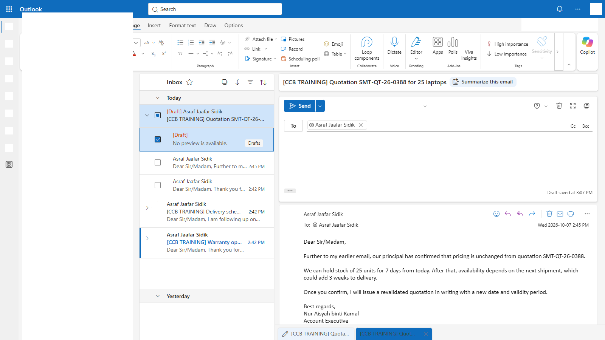
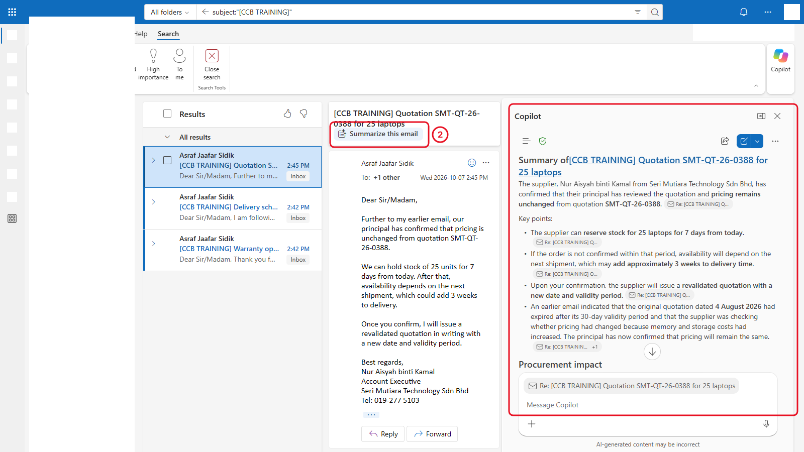
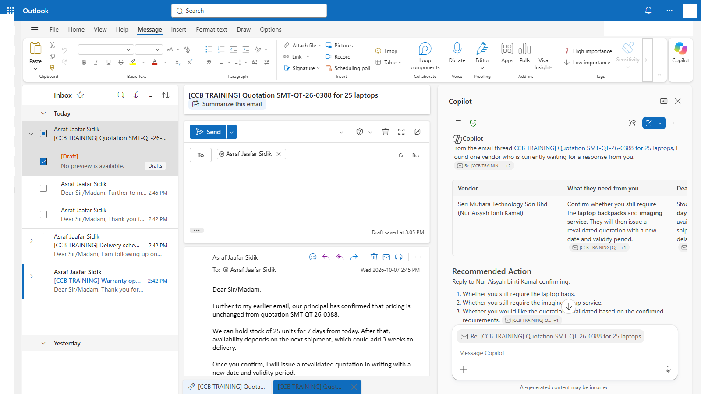
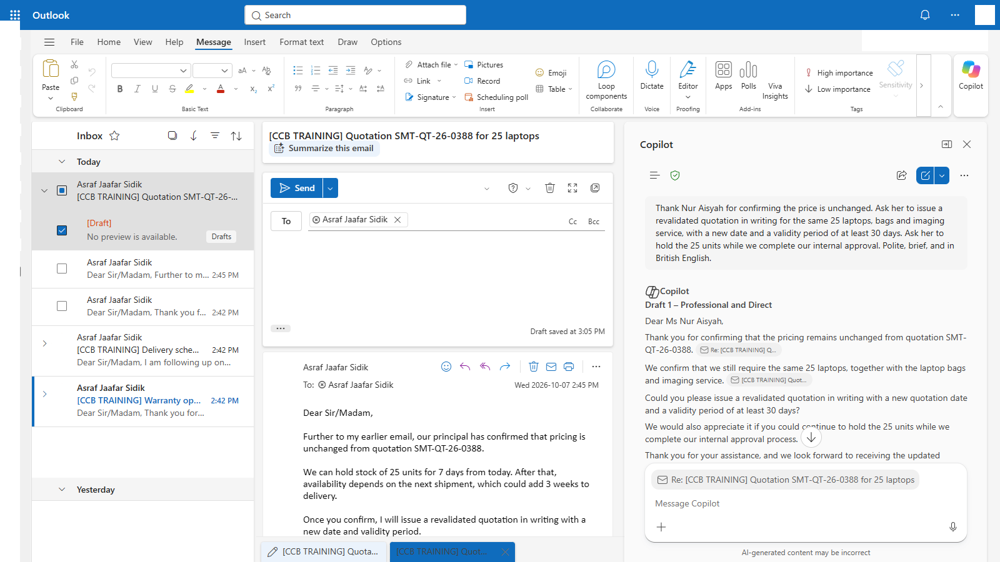
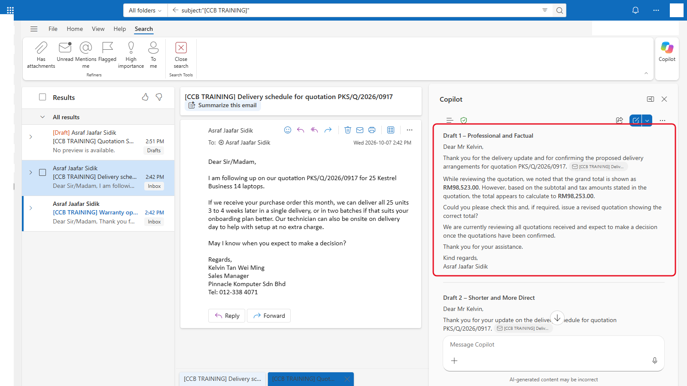

# 05 - Chase Vendors with Copilot in Outlook

Your comparison left you with things to chase: one quotation needs a corrected total, one needs to be revalidated, and one vendor has written about warranty options. Those conversations happen in email. Copilot in Outlook is included with both Basic labels, and it can summarise a thread, answer questions about your inbox, and draft your replies.

> **Prompts:** every prompt and email you need is in the steps, with a Copy button. The [prompts page](./prompts.md) has them all on one page too.

**Estimated time:** 45 minutes

**Your result:** Three vendor emails in your inbox, a summary of one thread, and two reply drafts: a request for a revalidated quotation and a request to correct a total.

---

## What You Will Learn

- Find Copilot in Outlook on the web and in the new Outlook for Windows
- Summarise an email thread
- Ask Copilot questions about your inbox
- Draft a reply with Copilot, then adjust its tone and length
- Check a draft before you send it

---

## Before You Begin

You need:

- Outlook on the web ([outlook.office.com](https://outlook.office.com)) or the new Outlook for Windows, signed in with your work account
- your findings from Chapter 4: which vendor's total is wrong, the printed and correct figures, and which quotation has expired

> **Note:** You need vendor emails in your inbox to practise with. In 5.1 you send them to yourself, so nothing goes outside your mailbox. Every subject starts with `[CCB TRAINING]` so they're easy to find and delete after the course.

> **Note:** Classic Outlook for Windows (the older desktop app) shows Copilot in different places, and some options may be missing. Use Outlook on the web for this chapter so your screen matches the pictures.

---

## 5.1 Send the Vendor Emails to Yourself

You create four emails: one each from the three vendors, and a follow-up from Seri Mutiara that forms a thread. The vendor's name is in each signature.

**Email 1: Seri Mutiara Technology**

1. In Outlook, select **New mail** (it may just say **New**).
2. In **To**, type your own email address.
3. Copy the subject and body for **Email 1** from the [prompts page](./prompts.md#part-1-vendor-emails-to-send-yourself) and paste them in.
4. Select **Send**.

**Emails 2 and 3: Cyberjaya Digital and Pinnacle Komputer**

5. Repeat steps 1 to 4 for **Email 2** and **Email 3**.

**Email 4: the Seri Mutiara follow-up (a reply, to make a thread)**

6. Wait for **Email 1** to arrive in your Inbox, then open it.
7. Select **Reply**. Leave the subject as it is.
8. Paste the body for **Email 4** at the top of the reply, above the original message. Select **Send**.



*The two Seri Mutiara messages appear as one conversation. That's the thread you summarise in 5.3.*

**Checkpoint:** You have three conversations in your Inbox, and the Seri Mutiara one has two messages.

> **Tip:** The emails come from you, so Outlook shows your name as the sender. Copilot reads the signature to work out who the vendor is. If it gets confused, add "The vendor is the person who signs each email" to your prompt.

---

## 5.2 Find Copilot in Outlook

Copilot shows up in three places in Outlook.

1. **On an open email:** a **Summarize** option at the top of the message. You use it in 5.3.
2. **In a reply or new email:** a **Copilot** icon in the toolbar, with **Draft with Copilot**. You use it in 5.5.
3. **The Copilot pane:** a **Copilot** button at the top of Outlook (or in the bar of apps on the left) opens a chat pane next to your mail. You use it in 5.4.

<!-- VERIFY: the current names and positions in Outlook on the web for a Copilot Chat (Basic) account: "Summarize" or "Summary by Copilot" on an open message, the Copilot icon and "Draft with Copilot" in compose, and the Copilot pane button. -->


*Three ways in: summarise a message, draft a reply, or chat in the pane.*

> **If you don't see this:** Copilot in Outlook can take time to appear for a new account, and your admin can turn it off. If you can't find any of the three, check you're in Outlook on the web with your work account, then tell your trainer. If Copilot shows but doesn't respond, standard access may be busy: wait a minute and try again.

---

## 5.3 Summarise a Vendor Thread

1. Open the Seri Mutiara conversation (subject **[CCB TRAINING] Quotation SMT-QT-26-0388 for 25 laptops**).
2. Select **Summarize** at the top of the message. A short summary appears above the email.
3. Read the summary. Check one thing in particular: does it give the vendor's **latest** position? The first email said prices may have changed. The follow-up says something different.



*A summary of the whole conversation. Check that it reflects the latest message.*

> **Key point:** Summaries can give equal weight to an early message and a later one that replaced it. When a thread changes its mind, check the summary against the most recent email.

---

## 5.4 Ask Questions About Your Inbox

The Copilot pane can look across your mailbox and calendar, not just the email in front of you.

1. Select the **Copilot** button to open the pane.
2. Paste this prompt and send it:

   ```
   Look at my emails with [CCB TRAINING] in the subject. Which vendors are waiting for a reply from me, and what does each one need from me? Put it in a table with the vendor, what they asked, and any deadline.
   ```

3. Check the table against the emails. Did Copilot find all three vendors, and the deadline in the Seri Mutiara follow-up?
4. Try a second question:

   ```
   Which vendor has offered a warranty upgrade, and at what price per unit?
   ```



*Copilot in Outlook can answer questions across your mailbox. Copilot Chat in the Copilot app can't see your mail, so ask mail questions here.*

> **If you don't see this:** If Copilot says it can't search your mailbox, the inbox feature may not have reached your organisation yet, or your admin may have limited it. Open each email and use **Summarize** instead.

<!-- VERIFY: Copilot Chat (Basic) users can ask questions across their inbox in the Outlook Copilot pane (Microsoft announced general availability in January 2026). -->

---

## 5.5 Draft a Request for a Revalidated Quotation

Policy Section 5.2 says an expired quotation must be revalidated **in writing**. Seri Mutiara's follow-up says the price hasn't changed, but an email isn't a revalidated quotation. Ask for one.

1. Open the Seri Mutiara conversation and select **Reply**.
2. In the toolbar, select the **Copilot** icon, then **Draft with Copilot**.
3. Paste the prompt below into the box, then select **Generate**.

   ```
   Thank Nur Aisyah for confirming the price is unchanged. Ask her to issue a revalidated quotation in writing for the same 25 laptops, bags and imaging service, with a new date and a validity period of at least 30 days. Ask her to hold the 25 units while we complete our internal approval. Polite, brief, and in British English.
   ```

4. Read the draft. Use the options under it to adjust, for example make it more formal or shorter, or type a change in the box such as `Mention that we need it by Friday.`
5. When you're happy, select **Keep it** (or **Insert**). The draft moves into your reply.

<!-- VERIFY: "Generate", the tone and length options, and "Keep it" are the current labels in Draft with Copilot. -->



*Copilot drafts. You read, adjust and decide whether to send.*

6. Read the email once more in the reply window. Check the quotation number, the quantity and the name. This reply goes to you, so you can send it, or close it and keep it in **Drafts**.

> **Important:** Always read a Copilot draft before you send it. Check names, numbers and any promise it makes on your behalf, such as a date or a commitment to buy. In real life this email goes to a supplier.

---

## 5.6 Draft a Correction Request

Policy Section 6.4 says an arithmetic error must be corrected by the vendor in a revised quotation. Pinnacle Komputer has emailed to ask when you'll decide. Use your reply to raise the error.

1. Open the Pinnacle Komputer email and select **Reply**.
2. Select **Copilot** > **Draft with Copilot**.
3. Replace the two figures in square brackets with the printed grand total and the correct grand total you found in 4.5, then select **Generate**.

   ```
   Thank Kelvin for the delivery update. Explain that while checking quotation PKS/Q/2026/0917 we found the grand total is printed as RM[printed grand total], but the subtotal plus tax comes to RM[correct grand total]. Ask him to check and issue a revised quotation with the correct total. Say we expect to decide once all quotations are confirmed. Polite and factual, no blame.
   ```

4. Check the draft. The two figures must match what you wrote, exactly. Copilot sometimes rounds or retypes numbers.
5. Keep the draft or send it to yourself.



*The figures came from your own check in Chapter 4. Copilot only wrote the words around them.*

> **Tip:** You give Copilot the numbers. Don't ask Copilot in Outlook to work out the correct total for you: it can't see the quotation PDF, and you've already checked it.

---

## Independent Practice

Reply to the Cyberjaya Digital email with **Draft with Copilot**. Ask for a revised quotation that includes the 3-year onsite warranty upgrade, so all three quotations are like-for-like in writing. Then check the draft mentions the right quotation number and warranty.

---

## After the Course

Search for `[CCB TRAINING]` in Outlook, select all the results, and delete them.

---

## Troubleshooting

| Symptom | What to check |
|---------|---------------|
| No Copilot options in Outlook | Use Outlook on the web with your work account. Classic Outlook may not show them all |
| The summary only covers the first email | Open the newest message in the conversation and summarise again |
| Copilot says you are the vendor | Add "The vendor is the person who signs each email" to your prompt |
| Copilot can't find the [CCB TRAINING] emails | Wait a few minutes after sending. New emails can take a moment to be searchable |
| The draft changes your figures | Edit them by hand in the reply, or regenerate with "Use these figures exactly" |
| Copilot stops responding | Standard access is busy. Wait a minute and try again |

---

## Lesson Summary

Copilot in Outlook summarised a thread, found what each vendor was waiting for, and drafted two careful replies in less time than it takes to write one. You supplied the facts, from your own checks, and Copilot supplied the wording. Next, you take everything from the comparison chat into a Page, write the justification memo, and export it.

**Check yourself:** Why did you check the summary against the most recent email? Why do you type the figures into the correction prompt yourself?
