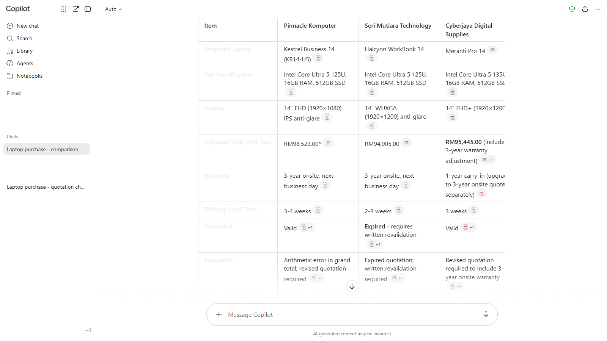
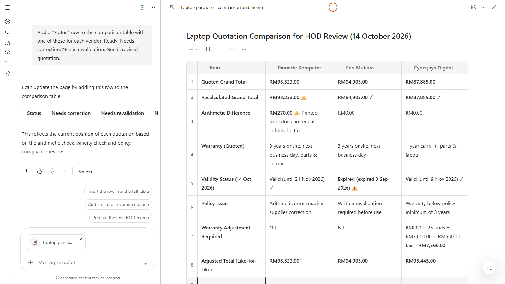
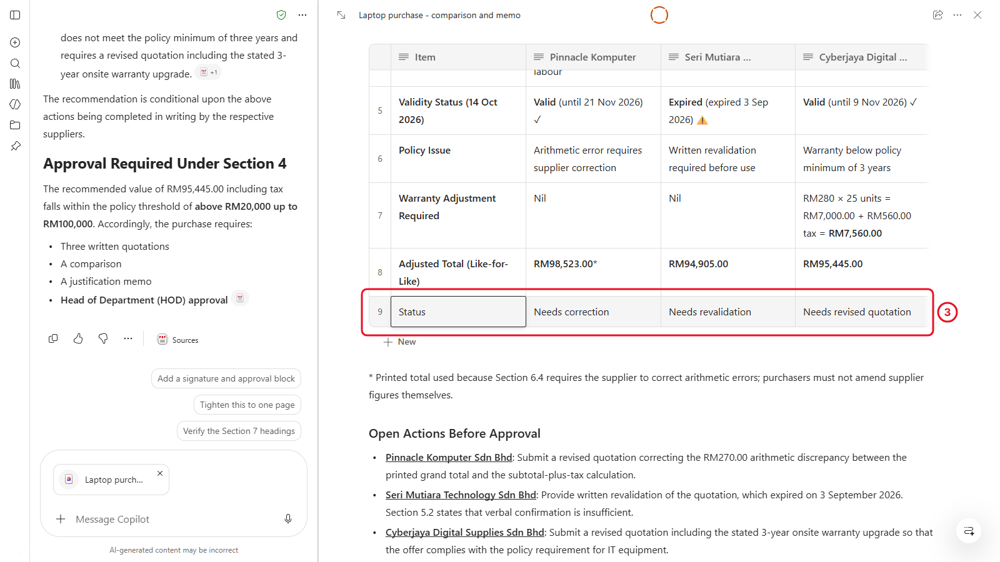
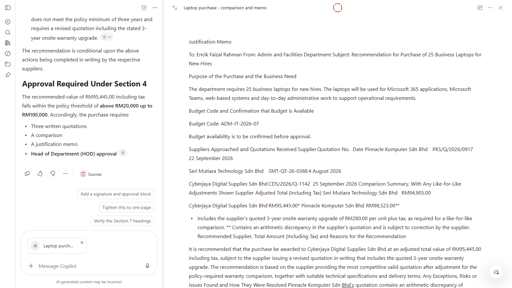
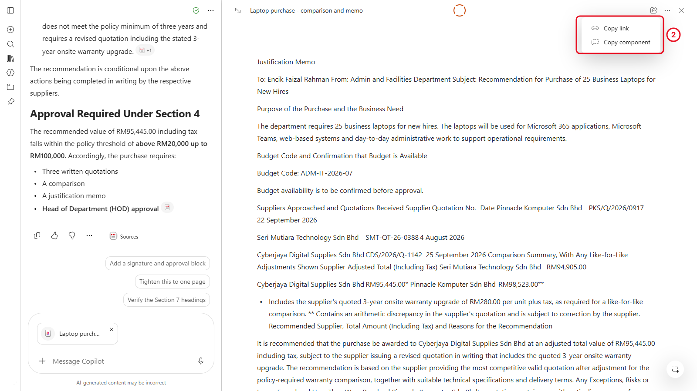
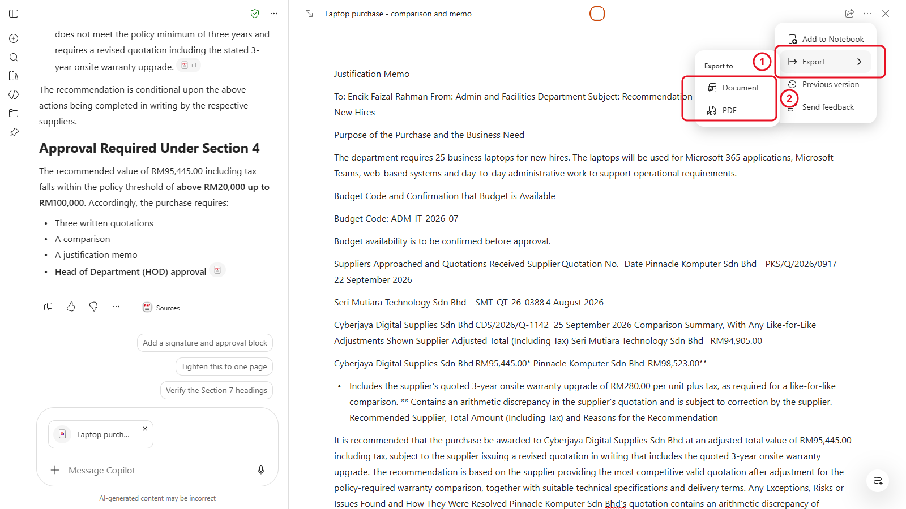

# 06 - From Chat to Pages

Your comparison lives in a long chat, and long chats have a weakness: the more you go back and forth, the more likely something you agreed earlier quietly drops out. In this chapter you see that happen, then move the comparison into a Copilot Page, where the content stays put and you can edit it like a document. You write the justification memo on the same Page, share it, and export it for the HOD.

> **Prompts:** every prompt you need is in the steps, with a Copy button. The [prompts page](./prompts.md) has them all on one page too.

**Estimated time:** 40 minutes

**Your result:** A Copilot Page with the checked comparison and the justification memo, shared with a colleague and exported as a Word document and a PDF.

---

## What You Will Learn

- Recognise when a long chat has started to drift
- Send a Copilot response to a Page
- Edit a Page by hand and with Copilot
- Write a justification memo that follows the policy
- Share a Page and export it to Word and PDF

---

## Before You Begin

You need the **Laptop purchase - comparison** chat from Chapter 4, with the four files still in it. If you lost it, start a new chat, upload the four files again, and run Parts 2 to 5 of the [Chapter 4 prompts](../04-compare-the-quotations/prompts.md) before you start.

---

## 6.1 Why Long Chats Drift

Copilot reads the whole chat each time you send a message, but it doesn't treat every earlier message equally. After several rounds of changes, a point you settled ten messages ago can quietly disappear from the latest version. Nobody tells you. It's just no longer there.

Try it.

1. Open the **Laptop purchase - comparison** chat.
2. Send these three changes, one at a time:

   ```
   Shorten the comparison table to the 8 rows that matter most to a manager.
   ```

   ```
   Make the language more formal, and add a final row with your overall comment on each vendor.
   ```

   ```
   Now give me the final comparison table, ready for the HOD.
   ```

3. Look at the final table and compare it with what you found in Chapter 4. Check for each of these:
   - the corrected grand total for the vendor with the arithmetic error
   - the expired validity of the other vendor's quotation
   - the warranty adjustment that made the comparison like-for-like



*After three rounds of changes, one of the Chapter 4 findings has gone. Nothing in the answer says so.*

**Checkpoint:** Did one of your findings disappear or change? In most classes, at least one does. If yours all survived, you were lucky, and it can still happen next time.

> **Key point:** When an answer matters and you've been changing it for a while, stop iterating in the chat. Ask for one complete version that lists everything it must include, then move it to a Page, where it can't drift.

---

## 6.2 Turn the Comparison into a Page

1. In the same chat, send this prompt. It names every finding, so none can be left out:

   ```
   Give me one complete comparison of the three laptop quotations for my HOD. Include: the figures exactly as printed; the recalculated grand totals, with the arithmetic error clearly marked; the validity of each quotation as of today, with the expired one clearly marked; the warranty adjustment that makes the comparison like-for-like, with adjusted totals; and a short list of open actions for each vendor. Use one table plus a short list of actions.
   ```

2. Check the answer against your Chapter 4 findings. Fix anything wrong now, with one more prompt, before you move it.
3. Under the response, select **Edit in Pages**. The Page opens next to the chat with the response copied into it.

<!-- VERIFY: the label under a response that creates a Page ("Edit in Pages", "Open in Pages" or the Pages icon) for Copilot Chat (Basic) users. -->



*The Page opens beside the chat. From now on, the Page is the version that counts.*

4. Select the title at the top of the Page and rename it:

   ```text
   Laptop purchase - comparison and memo
   ```

> **If you don't see this:** If there's no **Edit in Pages** option, select **Copy** under the response, open **Pages** from the left pane of the Copilot app, create a new Page, and paste. If Pages is missing from the left pane altogether, your organisation may have turned it off, or your account may not have OneDrive storage. Tell your trainer, and use a Word document instead for the rest of this chapter.

---

## 6.3 Edit the Page with Copilot

A Page is a document you can type in, with Copilot built in.

1. Click anywhere in the Page and type, the same as in Word. Correct any figure that doesn't match your own check.
2. Find the Copilot box on the Page (at the bottom or the side). Send:

   ```
   Add a "Status" row to the comparison table with one of these for each vendor: Ready, Needs correction, Needs revalidation, Needs revised quotation.
   ```

3. Check the change. Copilot edits the Page directly, so read what it changed before you go on.

<!-- VERIFY: where the Copilot prompt box sits on a Page, and whether edits are applied directly or offered for review first. -->



*You can type in the Page yourself or ask Copilot to change it. Either way, the Page keeps the result.*

> **Tip:** Type small fixes yourself. It's faster than asking Copilot, and you know exactly what changed.

---

## 6.4 Write the Justification Memo

Section 7 of the policy lists what the memo must include. Ask Copilot to follow it, on the same Page, above the comparison.

1. In the chat beside the Page, send this prompt. The policy is still uploaded in this chat, so Copilot can use Section 7:

   ```
   Write a justification memo to the HOD for the laptop purchase, following Section 7 of the procurement policy exactly. Use a heading for each item Section 7 lists. Recommend the vendor from our comparison, but make the recommendation conditional on the open actions being completed in writing. Use [budget code] and [HOD name] as placeholders. Keep it to one page, in plain British English.
   ```

2. Read the memo. Check that every item in Section 7 has a heading, and that the total is the right one for the recommended vendor.
3. Select **Edit in Pages** under the memo and choose to add it to your existing Page, **Laptop purchase - comparison and memo**. Move it above the comparison if it lands below.

<!-- VERIFY: whether "Edit in Pages" can add a second response to an existing Page, or only create a new one. If only new, copy the memo and paste it into the existing Page. -->

4. Replace `[budget code]` and `[HOD name]` with `ADM-IT-2026-07` and `Encik Faizal Rahman` (both fictional).



*Memo first, evidence after. The HOD reads the recommendation, then checks the table.*

> **Important:** Read every sentence of the memo as if you'd written it yourself, because you're the one signing it. Delete anything you can't back up from the quotations or the policy.

---

## 6.5 Share the Page

1. Select **Share** at the top right of the Page.
2. Type the name of the person your trainer pairs you with.
3. Choose whether they can edit or only view. For a memo you're about to send for approval, choose view.
4. Select **Send** (or **Copy link** and paste it into a Teams chat).
5. Ask your partner to open the link. They see the Page, but not your chat with Copilot.

<!-- VERIFY: the Share dialog options for a Page (specific people, edit/view) for Basic users. -->



*People you share with see the Page. They don't see the chat it came from or the files you uploaded there.*

---

## 6.6 Export to Word or PDF

Your HOD wants the memo as a document. Export the Page to Word, then save a PDF from Word.

1. At the top of the Page, select the **...** (More options), then the option to export or convert to Word.
2. Word for the web opens with your memo and comparison. The document is saved in your OneDrive.
3. Check the formatting, especially the table. Fix anything that moved.
4. To make a PDF: in Word for the web, select **File** > **Export** > **Download as PDF**. Open the PDF to check it.

<!-- VERIFY: the Page menu wording for "Convert to Word" / "Export to Word", whether the Page offers PDF directly, and the Word for the web path to download a PDF. -->



*Word for the web works without Copilot, so this step works with either Basic label.*

**Checkpoint:** You have a Page, a Word document in OneDrive, and a PDF in your Downloads folder, all with the same memo.

> **If you don't see this:** If the export option is missing, select everything in the Page (Ctrl+A), copy it, and paste it into a new Word document. The table may need tidying afterwards.

---

## Independent Practice

On your Page, ask Copilot to write a three-sentence summary of the memo for a Teams message to your HOD, letting them know the memo is coming. Put it at the end of the Page under a heading **Teams message**.

---

## Troubleshooting

| Symptom | What to check |
|---------|---------------|
| The memo is missing a policy item | Ask "Which items from Section 7 are missing from this memo?" and add them |
| Copilot says it can't see the policy | You're in a different chat from the one with the files. Go back to the comparison chat, or upload the policy again |
| Your partner can't open the shared Page | Check you shared it with their work account, not a personal address |
| The table breaks in Word | Select the table in Word and choose **Table** > **AutoFit** > **AutoFit to window** |
| Pages is missing | Your organisation may have turned Pages off, or you may not have OneDrive storage. Use Word instead |

---

## Lesson Summary

Long chats drift, so you moved the finished comparison into a Page, where it stays put and you can edit it directly. You wrote the memo against the policy, shared the Page, and turned it into a Word document and a PDF. Next, you put the whole purchase (quotations, policy and memo) into one Notebook.

**Check yourself:** What made the comparison drift, and what did you do to make sure the version on the Page was complete?
