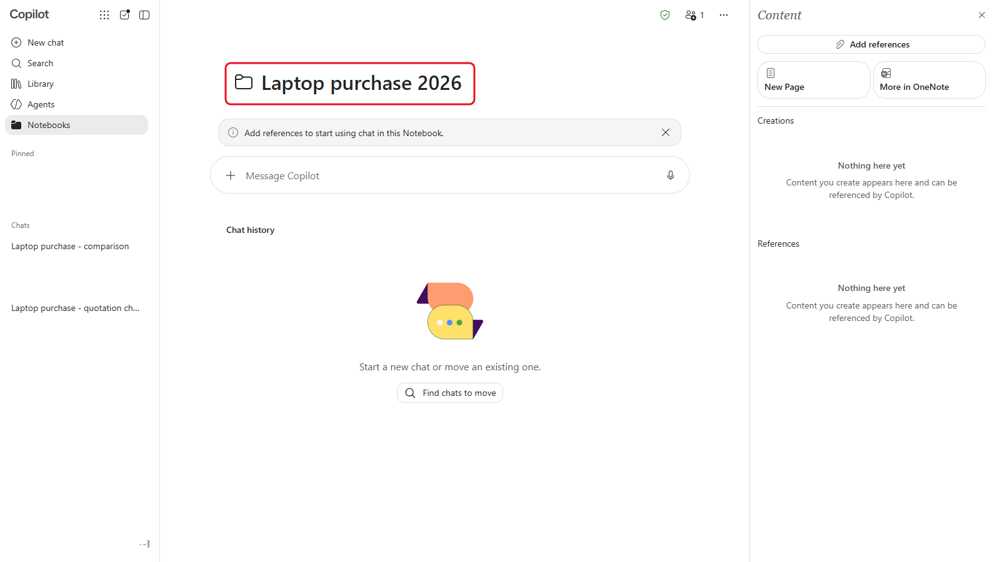
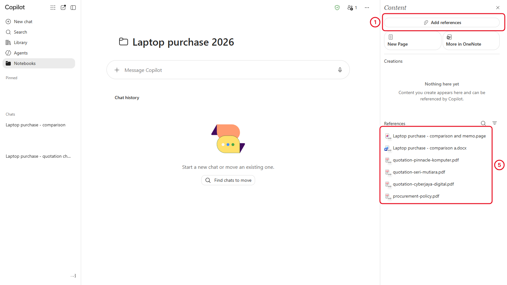
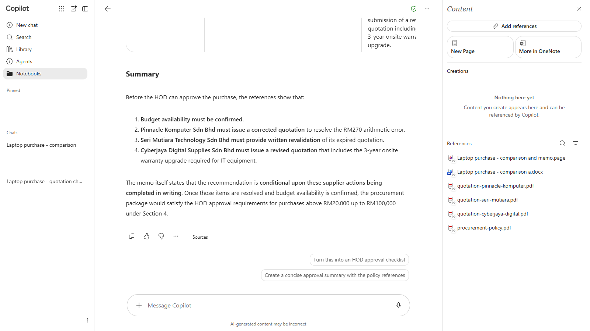
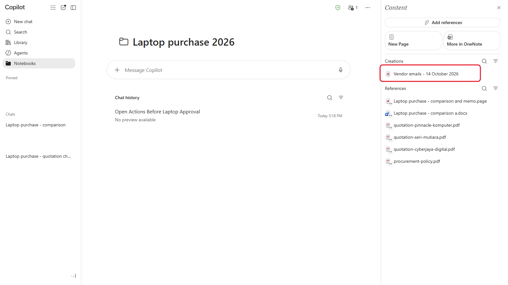

# 07 - Keep It Together in a Notebook

By now the laptop purchase is spread across a chat, a Page, a Word document, some PDFs and your inbox. When the revised quotations arrive next week, you'll want everything in one place, with Copilot able to answer questions across all of it. That's what a Copilot Notebook is for.

> **Prompts:** every prompt you need is in the steps, with a Copy button. The [prompts page](./prompts.md) has them all on one page too.

**Estimated time:** 30 minutes

**Your result:** A Notebook called **Laptop purchase 2026** holding the quotations, the policy and the memo, and a status update Copilot wrote from all of them.

---

## What You Will Learn

- Create a Copilot Notebook in the Microsoft 365 Copilot app
- Add files and Pages to a Notebook as references
- Ask Copilot questions that draw on everything in the Notebook
- Keep a Notebook current as a purchase moves on

---

## Before You Begin

You need:

- the four PDFs from `sample-files.zip` (Chapter 4)
- the Page **Laptop purchase - comparison and memo** (Chapter 6)
- the exported Word memo in your OneDrive (Chapter 6)

> **Note:** Use Notebooks in the **Microsoft 365 Copilot app**. OneNote also has a feature called Copilot Notebooks, but it isn't available to **Copilot Chat (Basic)** users. Everything in this chapter happens in the Copilot app, so it works with both Basic labels.

---

## 7.1 Create a Notebook

1. In the Copilot app, select **Notebooks** in the left pane.
2. Select **New notebook**.
3. In **Notebook name**, enter the name below, then select **Next**.

   ```text
   Laptop purchase 2026
   ```

4. The next step offers to add references. You add them in 7.2, so select **Create**. The Notebook opens with a message box and **Chat history** in the middle, and a **Content** pane on the right with **Creations** and **References**.



*A Notebook keeps its references, its Pages and its chats together, and you can come back to it any time.*

> **If you don't see this:** Notebooks reached Basic users from mid-June 2026, so it may still be on its way, or your admin may have turned it off. Notebooks are stored in your organisation's Microsoft 365 storage, so a full storage quota can also block them. If it's missing, watch your trainer's demo, and keep using your comparison chat and Page instead.

---

## 7.2 Add the Quotes, Policy and Memo

Everything you add becomes a **reference**: Copilot reads it whenever you ask a question in this Notebook.

1. In the **Content** pane, select **Add references**.
2. Select **Upload files** and upload the four PDFs from your extracted `sample-files` folder.
3. Select **Add references** again, then **OneDrive files**, and pick the Word memo you exported in Chapter 6.
4. Select **Add references** once more and search for **Laptop purchase - comparison and memo** to add your Page.
5. Wait until every reference shows in the list under **References**.



*Six references, one place. Copilot can now answer from all of them together.*

> **Tip:** Name things clearly before you add them. "Laptop purchase - comparison and memo" is easy to recognise in a list. "Page 3" isn't.

---

## 7.3 Ask Questions Across the Notebook

Questions that used to need three files open at once now take one prompt.

1. In the Notebook's chat box, send:

   ```
   Using all the references in this notebook, list every open action before the HOD can approve the laptop purchase. For each action, say which vendor it involves, which section of the procurement policy requires it, and where in the references you found it.
   ```

2. Check that the answer matches your memo. Copilot should cite the references it used. Select a citation to open it.
3. Send a second prompt, the kind of thing your HOD might ask you in the corridor:

   ```
   If Seri Mutiara's revalidated quotation comes back RM1,000 higher than before, does our recommendation change? Show the numbers.
   ```

4. Check the numbers with your calculator.



*Answers come from your references, with citations, so you can check where each point came from.*

5. Ask for a status update you could send today:

   ```
   Write a short status update for my HOD on the laptop purchase: what's done, what's pending, and the expected next step. Five bullet points at most.
   ```

> **Key point:** Copilot answers from the references you added. If a fact lives only in your inbox, such as Seri Mutiara's 7-day stock hold, the Notebook doesn't know it. Add it to a Page in the Notebook, or paste it into your prompt.

---

## 7.4 Keep the Notebook Up to Date

A Notebook is only useful while it's current.

1. Put the facts from Chapter 5 that aren't in any reference into a Page inside the Notebook. In the **Content** pane, select **New Page**, give it the title `Vendor emails`, then paste:

   ```text
   Vendor emails, [today's date]: Seri Mutiara confirmed pricing is unchanged and is holding 25 units for 7 days; a revalidated quotation will follow once we confirm. Cyberjaya Digital offered the 3-year onsite warranty upgrade at RM280 per unit. Pinnacle Komputer has been asked to correct its grand total.
   ```

2. Replace `[today's date]`. The Page saves as you type and appears under **Creations**, where Copilot can use it like a reference.
3. When a revised quotation arrives, upload it here and remove the version it replaces, so Copilot doesn't mix the two.



*A Page in the Notebook fills the gaps between documents: phone calls, emails and decisions.*

> **Important:** Remove superseded documents. If both the expired and the revalidated quotation are in the Notebook, Copilot may quote the wrong one.

---

## Independent Practice

Ask the Notebook: `Which vendor would be ready to approve first, and what exactly are we waiting for?` Check the answer against your own understanding. Then ask Copilot to turn the answer into a checklist on a new Page.

---

## Troubleshooting

| Symptom | What to check |
|---------|---------------|
| Notebooks isn't in the left pane | It may not have reached your organisation yet, or it's turned off. Ask your trainer |
| A reference won't upload | Check the file isn't open in another app, and try again. At busy times uploads can be limited |
| The answer ignores a reference | Ask "Which references did you use?" and name the missing one in your prompt |
| Copilot quotes an old figure | Remove the superseded file from the references |
| You're looking for this Notebook in OneNote | Notebooks for Basic users live only in the Copilot app |

---

## Lesson Summary

You put the whole purchase into one Notebook, asked questions that drew on every document at once, and added a Page to fill the gaps. When the revised quotations arrive, they go in the same Notebook. Next, you build an agent that runs the Chapter 4 checks for you on any quotation.

**Check yourself:** Why add the Chapter 5 email facts as a Page, and why remove a quotation once a revised one arrives?
