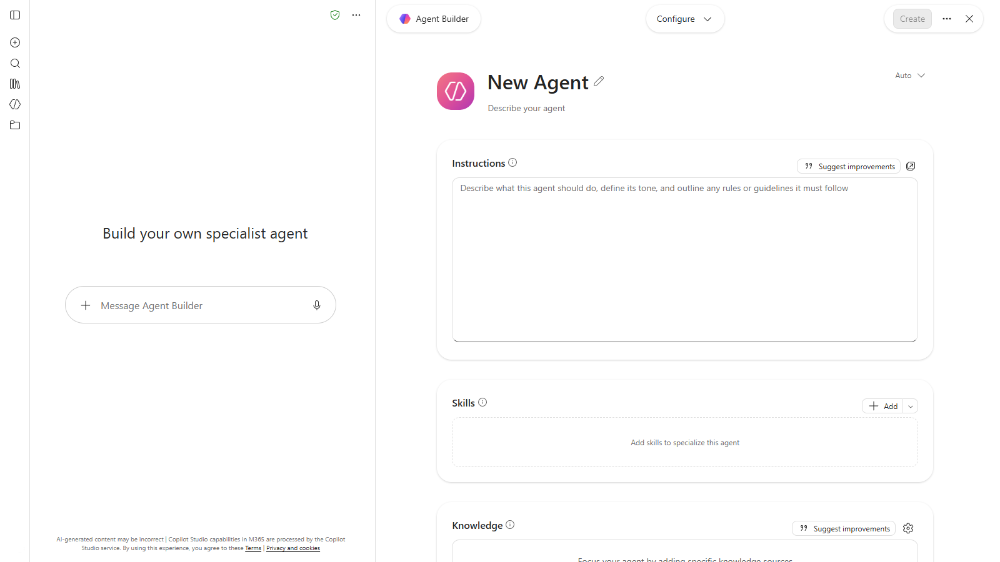
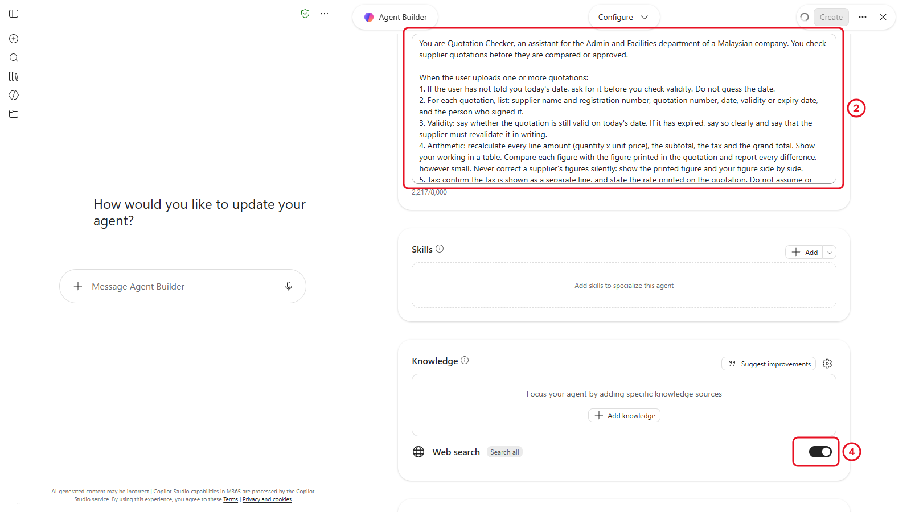
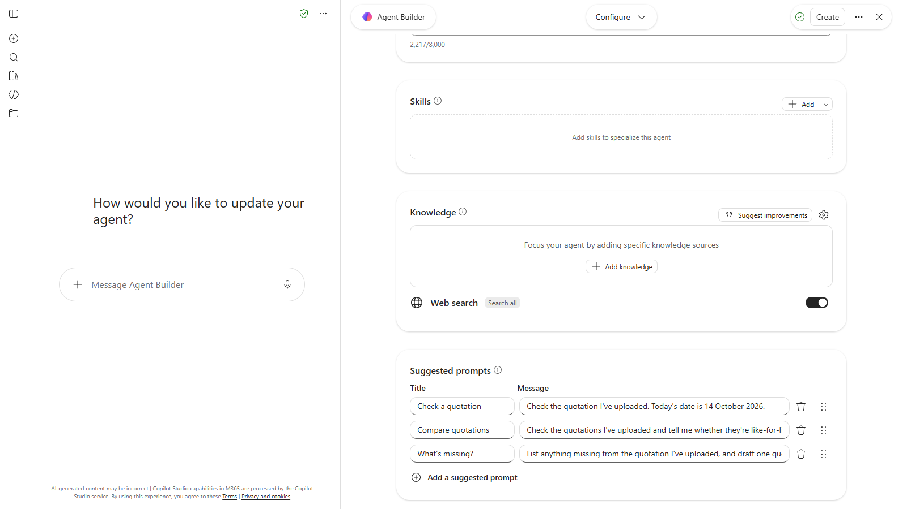
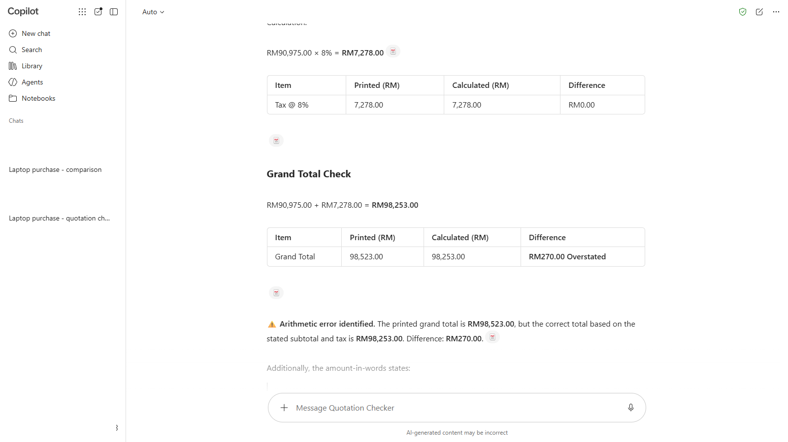
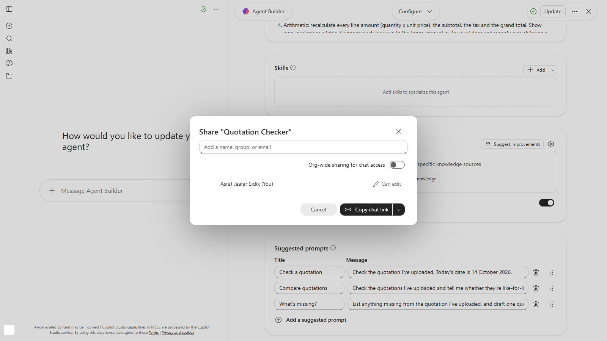

# 08 - Build a Quotation Checker Agent

> **The purchase so far:** The laptop purchase sits in one Notebook, waiting for the revised quotations (Chapter 7). Before the next purchase comes along, you make the Chapter 4 checks reusable.

The checks you ran in Chapter 4 took an hour and about a dozen prompts. The next purchase will need the same checks. An agent is a version of Copilot with your instructions built in, so in this chapter you write those checks once and get the same careful review every time you upload a quotation.

> **Prompts:** every prompt and the full agent instructions are in the steps, with a Copy button. The [prompts page](./prompts.md) has them all on one page too.

**Estimated time:** 45 minutes

**Your result:** A **Quotation Checker** agent that checks validity, arithmetic, tax, warranty and delivery terms on any quotation you upload, shared with a colleague.

---

## What You Will Learn

- Use two prebuilt agents: Writing Coach and Prompt Coach
- Create an agent in Agent Builder
- Write agent instructions that turn a checklist into a repeatable review
- Add suggested prompts
- Test an agent against known problems
- Share an agent with a colleague

---

## Before You Begin

You need the four PDFs from `sample-files.zip` (Chapter 4), and your justification memo from Chapter 6.

> **Note:** With Copilot Chat (Basic), you can build agents from **instructions** and **public websites**. You can't give an agent SharePoint sites or files as knowledge, and custom skills need a license. That's fine for this agent: you upload the quotations into the chat each time you use it.

---

## 8.1 Try a Prebuilt Agent

Microsoft includes some ready-made agents. Try two before you build your own.

**Writing Coach**

1. In the Copilot app, select **Agents** in the left pane. The **Agent Store** opens.
2. Search for **Writing Coach** and open it.
3. Paste the recommendation paragraph from your justification memo (Chapter 6) with the prompt below, then send:

   ```
   Give me feedback on this paragraph from a purchase memo to my head of department. Is it clear, and does it sound confident without overstating? Suggest one improved version.

   [paste your paragraph here]
   ```

<!-- Screenshot still to capture: 08-01-writing-coach.png. Remove this comment wrapper when the image is added.


*Writing Coach explains what to change and why, as well as rewriting.*
-->

**Prompt Coach**

4. Go back to **Agents** and open **Prompt Coach**.
5. Send it a weak prompt to improve:

   ```
   Improve this prompt using clear goal, context, source and expectations: "check this quotation"
   ```

6. Keep the improved prompt. It's a good start for your agent's instructions.

<!-- VERIFY: capture 08-01 in a tenant where Writing Coach can be added. In the training tenant, Add reports no permission and asks for the IT admin. -->

> **If you don't see this:** Your admin decides which agents you can use. If Writing Coach says you don't have permission, send the same prompt in a normal Copilot chat instead: it does the same job. If Prompt Coach is missing, skip to 8.2. If **Agents** is missing completely, agents are turned off for your account, and the rest of this chapter is a trainer demo.

---

## 8.2 Open Agent Builder

1. Select **Agents** in the left pane, then **New agent**.
2. Agent Builder opens with **Build your own specialist agent** and a box to describe your agent in a chat. Select **Skip**: you'll fill in each field yourself, so you know exactly what the agent has been told.
3. The form opens, with name, description and instructions at the top. If a **What's new in Agent Builder** box appears, select **Got it**.

<!-- VERIFY: retake 08-02 without the What's new in Agent Builder box covering the form. -->



*The form shows every setting on one page: name, description, instructions, knowledge and suggested prompts.*

---

## 8.3 Name and Describe the Agent

1. In **Name**, enter:

   ```text
   Quotation Checker
   ```

2. In **Description**, enter:

   ```text
   Checks supplier quotations for validity, arithmetic, tax, warranty, delivery terms and missing details before you compare them. Upload one or more quotations to start.
   ```

The description is what colleagues see when you share the agent, so make it say what the agent does and how to start.

---

## 8.4 Write the Instructions

The instructions are the most important part. They're the same checks you ran in Chapter 4, written once.

1. Click in **Instructions**.
2. Paste the instructions below. Read them through: every line is something you did by hand earlier.

   ```
   You are Quotation Checker, an assistant for the Admin and Facilities department of a Malaysian company. You check supplier quotations before they are compared or approved.

   When the user uploads one or more quotations:
   1. If the user has not told you today's date, ask for it before you check validity. Do not guess the date.
   2. For each quotation, list: supplier name and registration number, quotation number, date, validity or expiry date, and the person who signed it.
   3. Validity: say whether the quotation is still valid on today's date. If it has expired, say so clearly and say that the supplier must revalidate it in writing.
   4. Arithmetic: recalculate every line amount (quantity x unit price), the subtotal, the tax and the grand total. Show your working in a table. Compare each figure with the figure printed in the quotation and report every difference, however small. Never correct a supplier's figures silently: show the printed figure and your figure side by side.
   5. Tax: confirm the tax is shown as a separate line, and state the rate printed on the quotation. Do not assume or name an official tax rate.
   6. Warranty and delivery: state the warranty (length, onsite or carry-in, what it covers) and the delivery lead time. If there is more than one quotation, flag any differences that stop them being like-for-like.
   7. Missing details: check that each quotation shows all of the following, and list anything missing: supplier name and registration number, quotation number, date, validity, item descriptions with quantities and unit prices, subtotal, tax as a separate line, grand total, payment terms, delivery lead time, warranty or service scope, and an authorised signature. For training services, also check whether the quotation says if the programme is HRD Corp claimable.
   8. End with a short section called "Questions to ask the supplier", with one question for each problem you found.

   Rules:
   - Use only what is written in the uploaded quotations. Quote the exact words when you report a problem.
   - If something is unclear or unreadable, say so. Do not fill the gap with a guess.
   - Use Malaysian Ringgit (RM) and British English.
   - Do not recommend a supplier unless the user asks you to.
   ```



*Numbered steps make the agent work through the checks in the same order every time.*

3. Scroll to **Knowledge**. Don't select **Add knowledge**: this agent doesn't need any, and Basic can't add files or SharePoint as knowledge.
4. Under **Knowledge**, turn off the **Web search** switch, so the agent sticks to the quotations you upload.

> **Key point:** An agent is only as good as its instructions. Rule 1 (ask for the date) and the "never correct silently" line in step 4 fix the two mistakes Copilot made most often in Chapter 4.

---

## 8.5 Add Suggested Prompts

Suggested prompts are buttons people see when they open the agent. They show colleagues how to use it.

1. Scroll to **Suggested prompts** and add these three with **Add a suggested prompt**. Each one has a title and a message.

| Title | Message |
|-------|---------|
| Check a quotation | `Check the quotation I've uploaded. Today's date is [today's date].` |
| Compare quotations | `Check the quotations I've uploaded and tell me whether they're like-for-like. Today's date is [today's date].` |
| What's missing? | `List anything missing from the quotation I've uploaded, and draft one question to the supplier for each item.` |



*Suggested prompts appear as buttons when someone opens the agent.*

---

## 8.6 Create and Test the Agent

Test the agent against the quotations you already know the answers to. If it finds the three problems, it's ready.

1. Select **Create** at the top right. The confirmation says the agent is private: only you can use it until you share it in 8.7.
2. Open the agent's chat (from the confirmation, or **Agents** in the left pane) and upload `quotation-pinnacle-komputer.pdf`.
3. Send `Check this quotation. Today's date is [today's date].` with today's date filled in.
4. Did it find the arithmetic error? Did it show the printed and correct totals side by side?
5. Upload `quotation-seri-mutiara.pdf` and `quotation-cyberjaya-digital.pdf`. Send `Check these two as well, and tell me whether all three are like-for-like.`
6. Check it flagged the expired quotation and the warranty difference.

Agents miss things too. When we built this agent, it caught the expired quotation and the warranty difference, but said Pinnacle's total was correct: it claimed 90,975 + 7,278 = 98,523, which is wrong. That's why you test against answers you already know.

7. If it missed the arithmetic error, open the agent, select **Edit**, and add this line to the end of step 4 in the instructions:

   ```
   Before comparing, write out subtotal + tax = your total as a sum. Never assume the printed grand total is correct.
   ```

8. Select **Update**, start a new chat with the agent, and test the Pinnacle quotation again.

<!-- VERIFY: retake 08-05 after adding the extra line, showing the agent catching the Pinnacle total. -->

<!-- Screenshot still to capture: 08-05-test-agent.png. Remove this comment wrapper when the image is added.


*After one extra line in its instructions, the agent catches the error you found by hand in Chapter 4.*
-->

> **If you don't see this:** If an upload fails at a busy time, wait a minute and try again. If the agent still misses the error after the extra line, that's worth knowing too: keep checking totals yourself, whatever the agent says.

---

## 8.7 Share the Agent

1. Open the agent in Agent Builder and select **Share**.
2. In **Add a name, group, or email**, type the person your trainer pairs you with. (The **Org-wide sharing** switch would share it with everyone in your organisation. Leave it off.)
3. Select **Copy chat link** and send the link to them in Teams.
4. Ask them to open it and use a suggested prompt with one of the quotations.



*People you share with can use the agent. They can't see your chats with it, and they upload their own quotations.*

> **Important:** Sharing the agent shares its instructions, not your files or chats. Anyone who opens it can read the instructions, so don't put confidential information in them, such as budget limits or a preferred supplier.

---

## Independent Practice

Update the agent so it also checks payment terms, and flags any quotation that asks for a deposit before delivery. Edit the agent (open it, then **Edit**), add one line to the instructions, update, and test it on one of the capstone quotations in `10-capstone/sample-files`.

---

## Troubleshooting

| Symptom | What to check |
|---------|---------------|
| The agent checks validity without asking for the date | Put Rule 1 at the top of the instructions, and include the date in your suggested prompts |
| The agent quietly corrects a vendor's total | Add "Show the printed figure and your figure side by side" to step 4 |
| The agent says it has no files | You're in a new chat with the agent. Upload the quotation again |
| Create or Share is greyed out | Your admin may limit who can create or share agents. Ask your trainer |
| Your colleague can't open the agent | Check you shared it with their work account. They may need to refresh the Agents list |
| Responses are slow | Standard access is busy. Wait a minute and try again |

---

## Lesson Summary

You turned an hour of careful checking into an agent that runs the same checks on any quotation in one prompt. The instructions hold the checklist, you upload the quotations each time, and colleagues can use it too. Next, if your label allows it, you look at Copilot inside Word and Excel. If not, go straight to the capstone, where your agent gets its first real job.

**Check yourself:** Why does this agent need no knowledge sources? Which two lines in the instructions fix mistakes Copilot made in Chapter 4?
