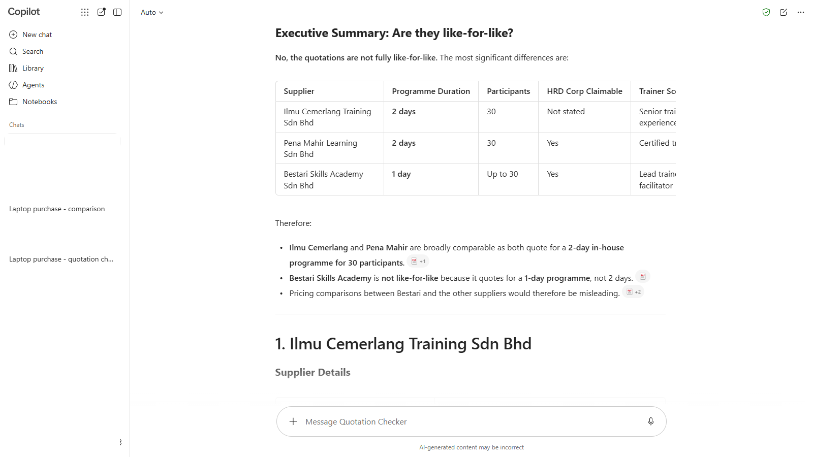
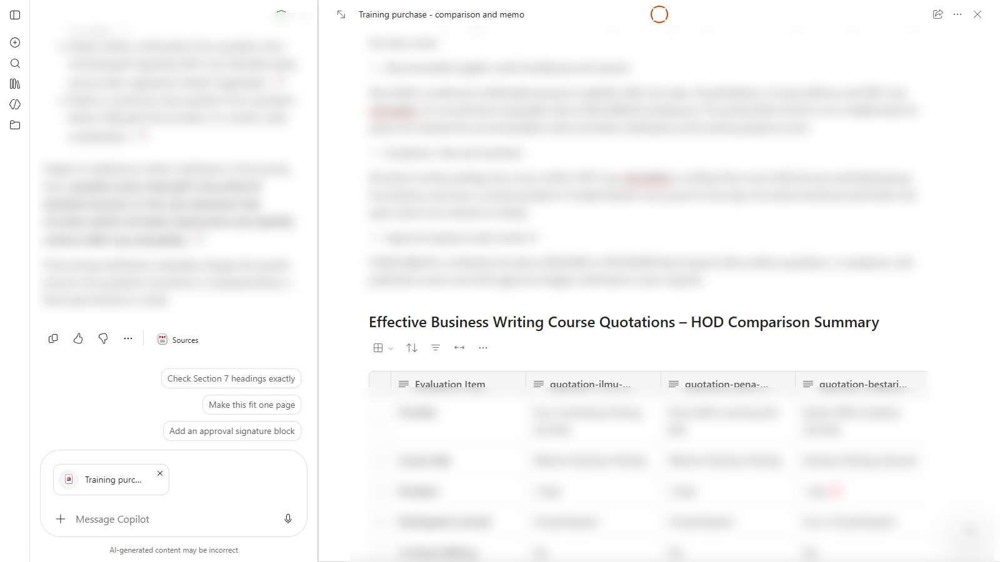

# 10 - Capstone: The Training Vendor Purchase

A second purchase has landed on your desk, and this time you run it yourself. You use the same stages as the laptop purchase (ask, compare, chase, draft, organise) and the agent you built in Chapter 8. Each stage tells you the goal, gives a hint, and says how to know you're done. The click-by-click steps are in the earlier chapters if you need them.

> **Prompts:** the [prompts page](./prompts.md) has starter prompts for each stage. Try writing your own first, with GCSE, and use the starters only if you get stuck.

**Estimated time:** 45 minutes

**Your result:** A checked comparison of three training quotations, chasing emails drafted for each provider, a justification memo on a Page, and everything filed in a Notebook.

---

## What You Will Learn

This chapter brings together everything from Chapters 2 to 8. There's nothing new to learn: the aim is to do it without step-by-step help.

---

## Before You Begin

You need:

- the green shield showing in the Copilot app
- your **Quotation Checker** agent from Chapter 8
- the procurement policy (there's a copy in this chapter's sample files)

---

## 10.1 The Brief

> **From your HOD:** The department needs a two-day in-house **Effective Business Writing** course for 30 executives, at Menara Teratai, in November 2026. HR says it must be HRD Corp claimable so we can use our levy. I've asked three providers to quote. Please check the quotations, compare them, and send me a recommendation with a memo, the same as you did for the laptops.

Before you start, look at the brief again and note the four things every quotation must match: **two days**, **30 participants**, **in-house**, and **HRD Corp claimable**.

---

## 10.2 Get the Files

1. Download **[sample-files.zip](./sample-files.zip)** and extract it.
2. You have four files:

| File | What it is |
|------|------------|
| `quotation-ilmu-cemerlang.pdf` | Ilmu Cemerlang Training Sdn Bhd, Johor Bahru |
| `quotation-pena-mahir.pdf` | Pena Mahir Learning Sdn Bhd, George Town |
| `quotation-bestari-skills.pdf` | Bestari Skills Academy Sdn Bhd, Kuala Lumpur |
| `procurement-policy.pdf` | The same policy extract as Chapter 4 |

> **Note:** All three providers and every detail in their quotations are fictional.

---

## 10.3 Draft the Requirements

**Goal:** A short list of requirements you'd send to training providers, written with GCSE.

**Hint:** Your Goal is the requirements list. The Context is the brief. Your Source is the brief plus anything Copilot can find about running an in-house writing course. Your Expectations are a numbered list for a request for quotation.

**Done when:** Your list includes duration, number of participants, venue, HRD Corp status, what the fee must include (materials, certificates) and what the quotation must show (validity, tax as a separate line, payment terms).

---

## 10.4 Compare the Quotations

**Goal:** A checked, like-for-like comparison of the three quotations.

**Hint:** Start with your **Quotation Checker** agent. Open it from **Agents**, upload all three quotations, use the **Compare quotations** starter prompt, and give it today's date. Then start a new Copilot Chat, upload the three quotations and the policy, and build the comparison table. Check every total with your calculator.

*Your agent's first real job. Check its findings against the quotations, the same as you would Copilot's.*

**Done when:** You've found one problem in each quotation and can name the policy section that applies to each. Look closely at how each provider prices the course, whether it covers what the brief asks for, and what each quotation says, or doesn't say, about HRD Corp.

> **Tip:** The cheapest quotation on paper may not be the cheapest once it matches the brief. Ask yourself whether each one is quoting for the same thing.

> **If you don't see this:** If your agent isn't under **Agents**, open the sharing link you copied in 8.7, or skip the agent and do the checks in Copilot Chat with the Chapter 4 prompts. If an upload fails or Copilot stops responding, standard access may be busy: wait a minute and try again. If your admin has turned off Notebooks or Pages, use a Word document for 10.6 and a OneDrive folder for 10.7.

---

## 10.5 Chase the Providers

**Goal:** One email to each provider asking for exactly what you need to fix its quotation.

**Hint:** In Outlook, create a **New mail** to yourself with a subject starting `[CCB TRAINING]`, then use **Draft with Copilot**. Give Copilot the facts in your prompt: the quotation number, the problem and what you need. Don't ask Copilot to work out figures it can't see.

**Done when:** You have three drafts. Each one names the quotation number, explains the problem politely, and asks for a revised quotation or written confirmation.

---

## 10.6 Write the Memo

**Goal:** A justification memo on a Page that follows Section 7 of the policy.

**Hint:** Ask for one complete comparison in the chat (list everything it must include, so nothing drifts), then use **Edit in Pages**. Write the memo in the same chat, where the policy is uploaded, and add it to the Page. Make the recommendation conditional on the open actions.

*Same structure as the laptop memo: recommendation first, evidence after.*

**Done when:** The memo covers every item in Section 7, says which approval the amount needs, explains why the cheapest-looking quotation isn't the recommendation (if it isn't), and has no figure you haven't checked.

---

## 10.7 File It in Your Notebook

**Goal:** Everything for the training purchase in one Notebook.

**Hint:** Create a new Notebook called `Training purchase 2026`. Add the three quotations, the policy and your Page, plus a note about the emails you drafted.

**Done when:** You can ask the Notebook `What's still outstanding before the HOD can approve this?` and get a correct answer with citations.

---

## 10.8 Run Your Quotation Checker

**Goal:** Use your agent as a final check on whatever you'd send to the HOD.

**Hint:** Imagine one provider sends a revised quotation. Upload the original quotation to the agent and ask: `If the supplier fixed only the problem I raised, would this quotation pass every check?`

**Done when:** You're confident that the memo, the comparison and the chasing emails tell the same story.

---

## Capstone Checklist

Tick these off before you tell your trainer you've finished.

- [ ] I wrote the requirements with all four GCSE parts.
- [ ] My comparison shows each figure as printed, and I checked every total myself.
- [ ] I found one problem in each quotation and know which policy section applies.
- [ ] I drafted one chasing email per provider, with facts I gave Copilot myself.
- [ ] My memo is on a Page, follows Section 7, and makes the recommendation conditional.
- [ ] Everything is in the **Training purchase 2026** Notebook.
- [ ] I could explain every number in the memo without Copilot.

---

## Troubleshooting

| Symptom | What to check |
|---------|---------------|
| The agent doesn't ask for the date | Include today's date in your prompt. Then update the agent's instructions (Chapter 8) |
| One total looks far too small | Read the pricing lines carefully. Is the fee per person or per group? |
| A quotation looks cheapest by a long way | Check it quotes for the same course as the brief |
| Copilot can't see the files | You're in a different chat from the one you uploaded to |
| Anything else | Go back to the matching chapter: comparison (4), emails (5), Pages (6), Notebooks (7), agent (8) |

---

## Lesson Summary

You ran a whole purchase with Copilot: requirements, comparison, chasing, memo and filing, with your own agent doing the first round of checks. Copilot did the reading, the layout and the drafting. You did the checking and the judging, which is the part your HOD is relying on. For more practice, try the four short exercises in Chapter 11.
