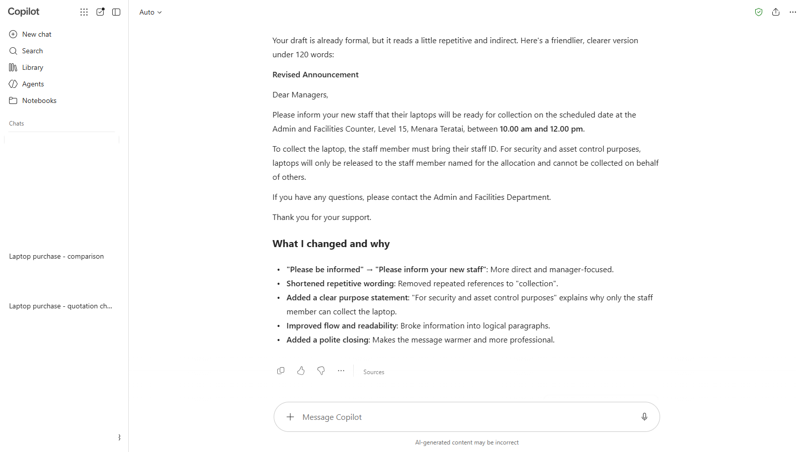
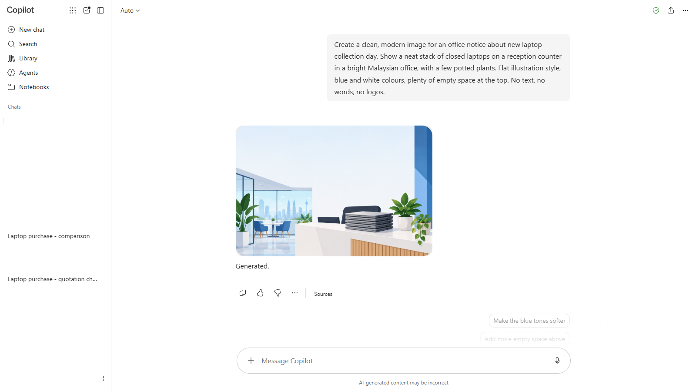
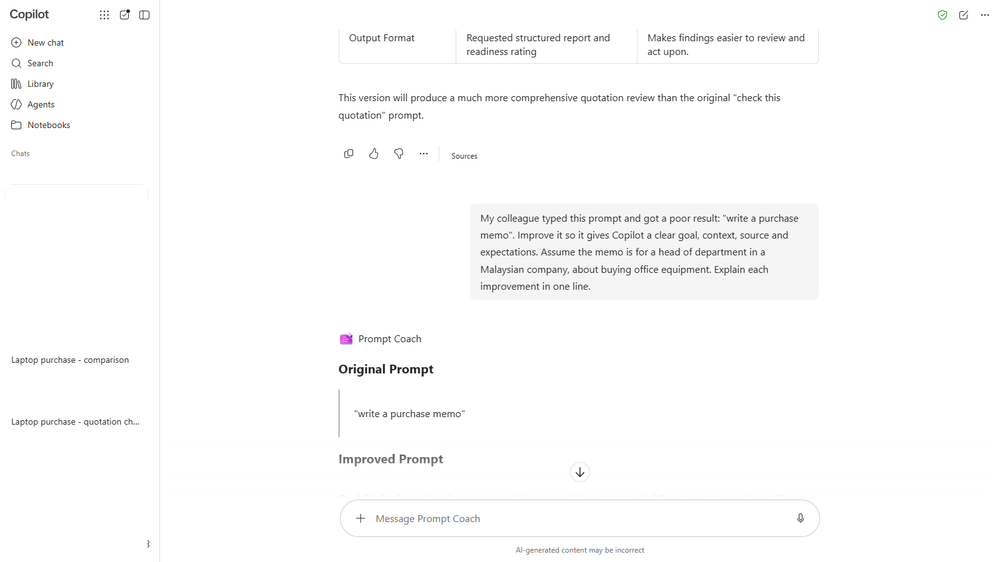
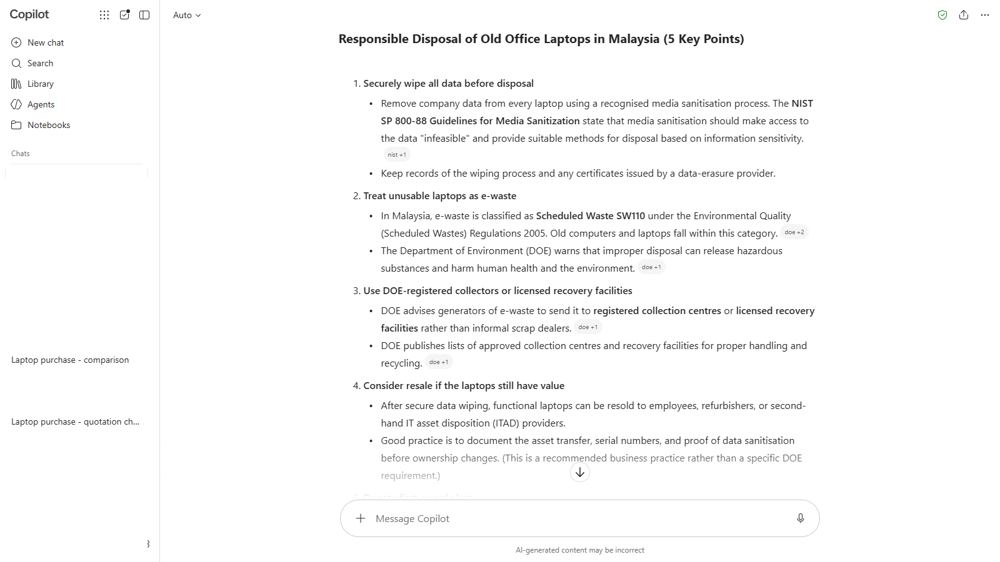

# 11 - Extra Practice

Four short exercises for when you finish early, or for practice back at your desk. They follow on from the laptop purchase but stand on their own, and each one uses only the features that come with both Basic labels.

> **Prompts:** every prompt you need is in the steps, with a Copy button. The [prompts page](./prompts.md) has them all on one page too.

**Estimated time:** 10 to 15 minutes each, self-paced

**Your result:** Up to four small pieces of finished work, each built with the skills from Chapters 2 to 8.

---

## Which One Should I Try?

| Exercise | What you make | Practises | Where |
|----------|---------------|-----------|-------|
| A. Polish an announcement | A staff announcement about the new laptops | Writing Coach, iterating | Copilot app, Agents |
| B. Make a notice image | A notice image for laptop collection day | Visual Creator, describing a picture | Copilot app, Agents |
| C. Improve a weak prompt | A strong GCSE prompt from a weak one | Prompt Coach, GCSE | Copilot app, Agents |
| D. Research with sources | A short, sourced note on disposing of old laptops | Web grounding, checking sources | Copilot app, Chat |

> **If you don't see this:** Your admin decides which prebuilt agents you see. If one is missing, do the same exercise in a normal Copilot Chat with the same prompt. Image generation can also be limited or slow at busy times with standard access: if Visual Creator says it can't make an image right now, try again later.

<!-- VERIFY: Writing Coach, Prompt Coach and Visual Creator appear under Agents for Copilot Chat (Basic) users, and Visual Creator's current name. -->

---

## A. Polish an Announcement

**The problem:** The laptops are coming, and the new hires' managers need to know how collection works. Your first draft is accurate but stiff.

1. In the Copilot app, select **Agents**, then **Writing Coach**.
2. Paste the prompt from the [prompts page](./prompts.md#exercise-a-writing-coach), which includes the draft, and send it.
3. Read the feedback. Ask for one change at a time, for example `Make the opening friendlier, and keep it under 120 words.`
4. When you're happy, copy the final version.

*Writing Coach tells you what it changed and why. Use that to improve your own first drafts next time.*

**Done when:** Your announcement is under 120 words, has the date, place and what to bring, and sounds like you.

---

## B. Make a Notice Image

**The problem:** You want a simple image for the notice board and the Teams post about laptop collection day.

1. Select **Agents**, then **Visual Creator**.
2. Send the prompt from the [prompts page](./prompts.md#exercise-b-visual-creator).
3. Look at the image. Ask for one change at a time, for example `Use a calmer colour scheme with blue and white.`
4. Download the image you like best.

*Describe the scene, the style and the colours. Leave the exact words for the notice text itself.*

> **Important:** AI images often get text wrong: spelling, dates and numbers. Ask for an image **without** words, and put the date and place in the notice text yourself. Don't ask for company logos or real brand names.

**Done when:** You have an image with no text in it that you'd be happy to put above the announcement from Exercise A.

---

## C. Improve a Weak Prompt

**The problem:** A colleague tells you "Copilot is useless, I asked it to write a memo and got rubbish." Their prompt was four words long.

1. Select **Agents**, then **Prompt Coach**.
2. Send the prompt from the [prompts page](./prompts.md#exercise-c-prompt-coach).
3. Read Prompt Coach's version. Which GCSE parts did it add?
4. Run the improved prompt in a new Copilot Chat. Compare the result with what the four-word prompt gives.

*The improved prompt adds a goal, context, source and expectations. That's GCSE from Chapter 3.*

**Done when:** You can explain to your colleague, in one sentence, why their prompt didn't work.

---

## D. Research with Sources

**The problem:** The 25 new laptops mean some old ones will be retired. Your HOD asks how the company should dispose of old laptops properly in Malaysia.

1. Select **New chat**.
2. Send the prompt from the [prompts page](./prompts.md#exercise-d-research-with-sources).
3. Open at least two of the sources. For each one, check who published it, when, and whether it says what Copilot says it does.
4. Ask the follow-up prompt to separate checked facts from Copilot's general advice.

*Regulations change. Check that each source is current and from an official or reputable body.*

**Done when:** You have a short note of no more than five points, each backed by a source you've opened and checked.

---

## Lesson Summary

Writing Coach, Visual Creator and Prompt Coach are ready-made agents you can use any time. Web research with sources works best when you check the sources yourself. All four exercises use what comes with your Basic license, so you can keep practising at your desk tomorrow.
