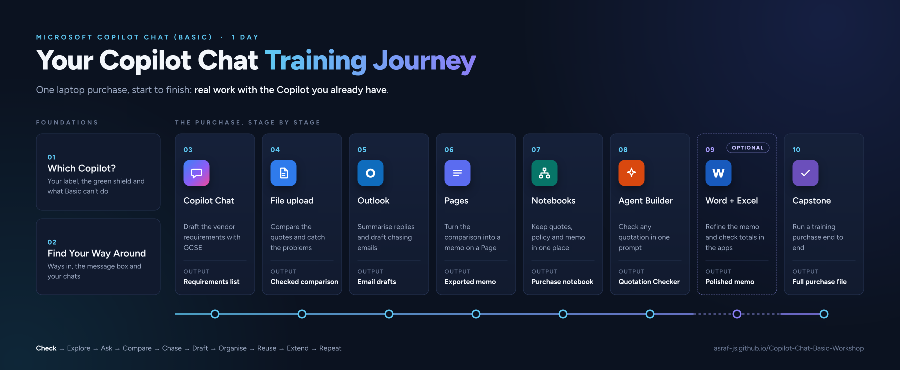

# Copilot Chat Basic Workshop

Participant resources for the one-day **Copilot Chat Basic Workshop**: step-by-step chapter notes with screenshots, ready-to-paste prompts, a printable course book and sample files. The course is for people who use Microsoft Copilot at work without the paid Microsoft 365 Copilot license.

You do not need a GitHub account to use anything on this page.

**Version 1.0**, last updated 6 October 2026.

---

## Program Flow

---

## How to Use This Site

Each chapter has a **Notes** page with point-and-click steps and screenshots, and a **Prompts** page with every prompt you type during the exercises. The notes tell you which prompt to use and when.

To copy a prompt: open the chapter's prompts page, find the prompt, and click the copy icon in the top-right corner of the grey box. Then paste it into Copilot. Copying from the box is safer than copying from the PDF, which can add line breaks in the middle of a sentence.

To download everything: **[download all course files (ZIP)](https://github.com/Asraf-JS/Copilot-Chat-Basic-Workshop/archive/refs/heads/main.zip)**. Save the ZIP, then right-click it and choose **Extract All** before you open any file.

To read offline or print: download the **[course book (PDF)](./Copilot-Chat-Basic-Workshop-Book.pdf)**. It has every chapter's notes and prompts in one file.

---

## Course Scenario

Throughout the course you handle one real purchase from start to finish.

> **You're an executive in the Admin and Facilities department at Teratai Holdings Berhad.** The department needs 25 new laptops for next quarter's hires. Company policy says any purchase above RM20,000 needs three written quotations, a comparison, and a justification memo before the HOD signs off.

Each chapter takes you one stage further with that purchase:

| Stage | What happens |
|-------|-------------|
| Check | Confirm your Copilot label and the EDP shield before touching any company document |
| Explore | Tour the Copilot app and run a first prompt about what to look for in a laptop quotation |
| Ask | Use GCSE to draft the requirements you'll send to vendors |
| Compare | Upload the three quotations and the procurement policy, build a side-by-side comparison, and catch the problems |
| Chase | Use Copilot in Outlook to summarise vendor replies and draft a request for a revised quote |
| Draft | Move the comparison into a Page and write the justification memo, then export it |
| Organise | Put the quotes, policy and memo in one Notebook so the whole purchase lives in one place |
| Reuse | Build a Quotation Checker agent so the next purchase takes minutes |
| Extend | Optional: open the comparison or memo in the Office apps with in-app Copilot (M365 Copilot Basic only) |
| Repeat | Capstone: run a second purchase end to end on your own |

---

## Chapters

| # | Chapter | Prompts | What you will do | Time |
|---|---------|---------|------------------|------|
| 01 | [Which Copilot do I have?](./01-which-copilot-do-i-have/) | [Prompts](./01-which-copilot-do-i-have/prompts.md) | Find your Copilot label, check for the green shield, and learn what Basic can and can't do | 20 min |
| 02 | [Find your way around](./02-find-your-way-around/) | [Prompts](./02-find-your-way-around/prompts.md) | Open Copilot from the app, Edge, Teams and Outlook, run a first prompt, and manage your chats | 30 min |
| 03 | [Write better prompts](./03-write-better-prompts/) | [Prompts](./03-write-better-prompts/prompts.md) | Use GCSE to draft the laptop requirements, improve the answer, and check its sources | 45 min |
| 04 | [Compare the quotations](./04-compare-the-quotations/) | [Prompts](./04-compare-the-quotations/prompts.md) | Upload three quotations and the policy, build a comparison table, and find the problems | 60 min |
| 05 | [Chase vendors with Copilot in Outlook](./05-copilot-in-outlook/) | [Prompts](./05-copilot-in-outlook/prompts.md) | Summarise vendor emails and draft a request for a revised quotation | 45 min |
| 06 | [From chat to Pages](./06-from-chat-to-pages/) | [Prompts](./06-from-chat-to-pages/prompts.md) | Move the comparison into a Page, write the justification memo and export it | 40 min |
| 07 | [Keep it together in a Notebook](./07-copilot-notebooks/) | [Prompts](./07-copilot-notebooks/prompts.md) | Collect the quotes, policy and memo in one Notebook and ask questions across them | 30 min |
| 08 | [Build a Quotation Checker agent](./08-build-a-quotation-checker/) | [Prompts](./08-build-a-quotation-checker/prompts.md) | Build, test and share an agent that checks any quotation for you | 45 min |
| 09 | [Optional: Copilot in Word and Excel](./09-copilot-in-office-apps/) | [Prompts](./09-copilot-in-office-apps/prompts.md) | Refine the memo in Word and the comparison in Excel (M365 Copilot Basic only) | 30 min |
| 10 | [Capstone: the training vendor purchase](./10-capstone/) | [Prompts](./10-capstone/prompts.md) | Run a second purchase end to end with less help | 45 min |
| 11 | [Extra practice](./11-extra-practice/) | [Prompts](./11-extra-practice/prompts.md) | Four small exercises for fast finishers and practice after the course | Self-paced |

---

## Sample Data

**[sample-files.zip](./04-compare-the-quotations/sample-files.zip)** in the Chapter 4 folder holds the laptop purchase files: three fictional vendor quotations and `procurement-policy.pdf`, an extract from Teratai Holdings' procurement policy. Chapters 4 to 9 use them.

**[sample-files.zip](./10-capstone/sample-files.zip)** in the Chapter 10 folder holds three fictional quotations from training providers for the capstone.

Every company, person, address, phone number and registration number in these files is made up. The tax rate in the quotations is for training only.

---

## Before You Start

- Use only the fictional data in these files during class. Don't upload real company documents to practise.
- Check the green shield in Copilot before you upload anything (Chapter 1 shows you how).
- Only send test emails to yourself. Every training email subject starts with `[CCB TRAINING]`.
- Copilot can be wrong. Check its numbers and claims before you use them, the same as you would a colleague's draft.

---

## What to Learn Next

These free Microsoft resources pick up where the course ends.

- [Microsoft 365 Copilot Chat overview](https://learn.microsoft.com/en-us/copilot/overview): what Copilot Chat is and how your organisation's data is protected.
- [Copilot Prompt Gallery](https://m365.cloud.microsoft/copilot-prompts): ready-made prompts you can save and reuse.
- [Get started with Microsoft 365 Copilot (Microsoft Learn)](https://learn.microsoft.com/en-us/training/paths/get-started-with-microsoft-365-copilot/): a free learning path if you move to the paid license later.

<!-- VERIFY: all three links resolve and still describe the Basic experience. -->

---

## Need Help?

During the course, ask your trainer. After the course, contact the training coordinator who arranged your class.

---

*Last updated: October 2026 | Trainer: Asraf*

© Asraf Jaafar Sidik, Microsoft Certified Trainer. These materials are for course participants' personal use. Please don't redistribute or resell them.
